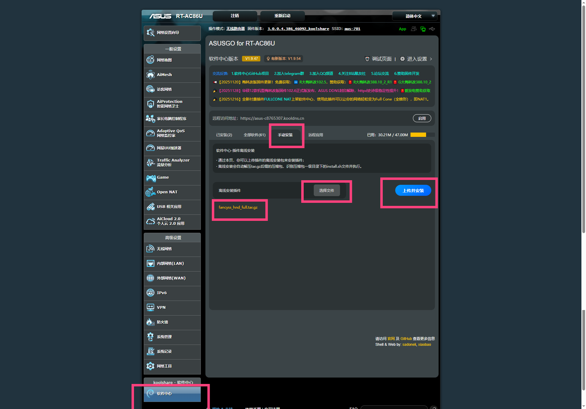
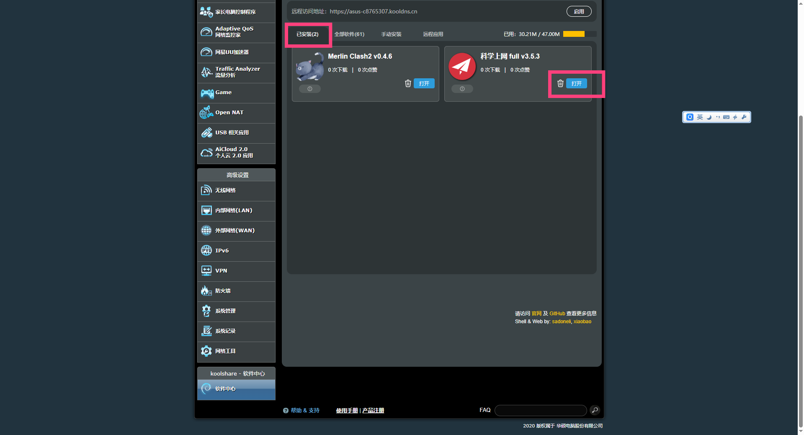
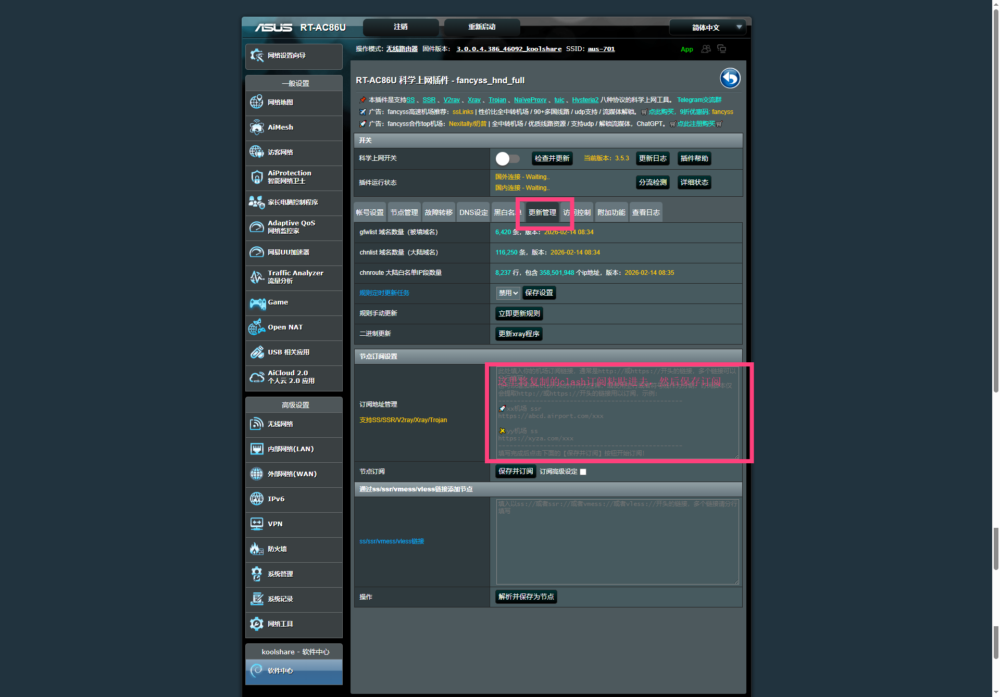
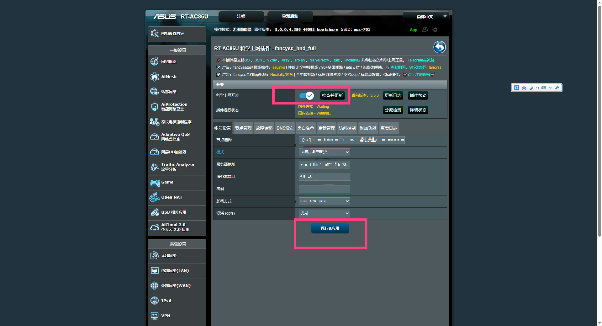
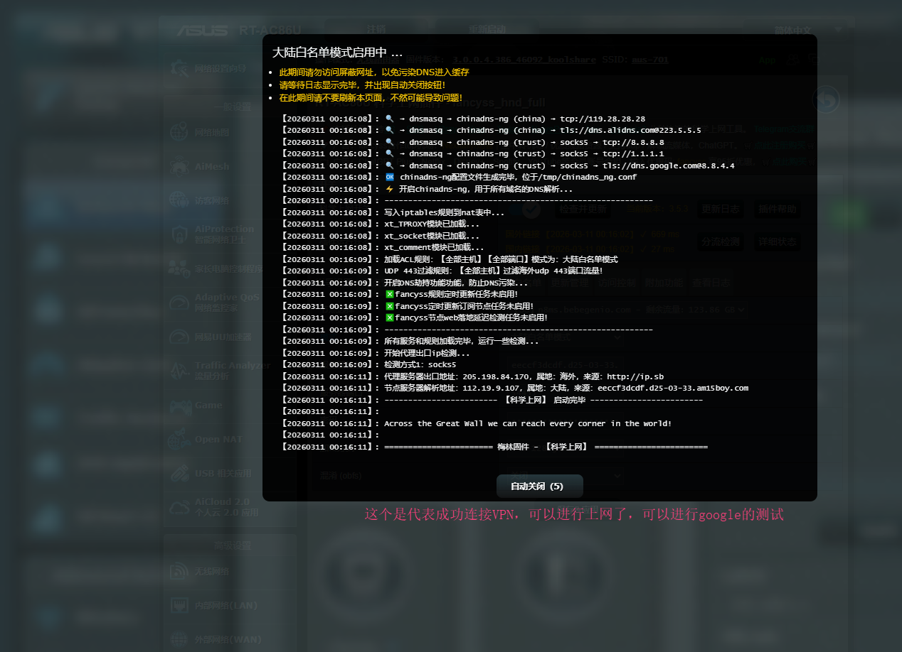
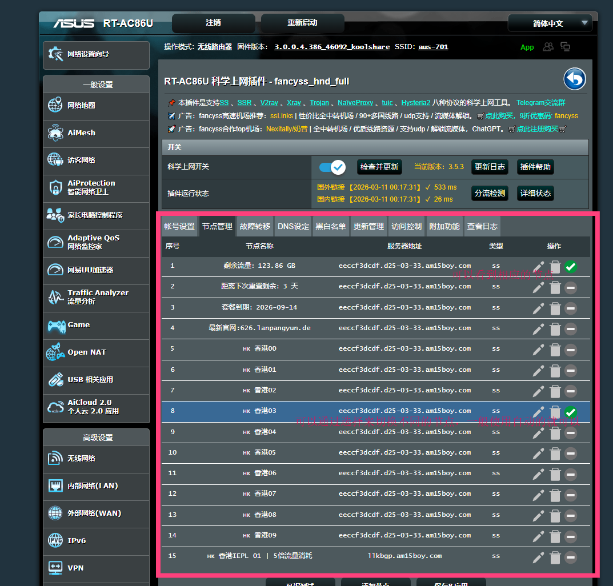

# 华硕路由器高级功能配置

> 📄 本文对应 HTML 页面：[华硕路由器教程](../docs/pages/asus-router-guide.html)

本教程介绍 MerlinClash 的高级功能配置，包括分流规则、游戏加速、流媒体解锁、广告过滤、性能监控、日志分析、常见故障排除以及安全与隐私设置，帮助用户充分发挥路由器科学上网方案的潜力。

---

## 📋 目录

- [一、分流规则配置](#一分流规则配置)
- [二、游戏加速](#二游戏加速)
- [三、流媒体解锁](#三流媒体解锁)
- [四、广告过滤](#四广告过滤)
- [五、性能监控](#五性能监控)
- [六、日志分析](#六日志分析)
- [七、常见问题排查](#七常见问题排查)
- [八、安全与隐私](#八安全与隐私)
- [九、Fancyss 可选方案补充](#九fancyss-可选方案补充)

---

## 一、分流规则配置

### 1.1 分流规则概述

分流规则决定哪些流量走代理、哪些直连，合理配置可兼顾速度与稳定性：

- **国内直连**：国内网站直接连接，提高访问速度
- **国外代理**：国外网站通过代理访问
- **特殊规则**：为特定应用或域名设置单独规则

### 1.2 规则设置入口

1. 进入 MerlinClash 管理界面
2. 点击 **规则设置** 或 **分流规则**
3. 选择预设规则或自定义规则

### 1.3 分流策略建议

| 策略 | 适用场景 | 说明 |
|------|----------|------|
| **国内直连** | 国内网站、应用 | 降低延迟，节省代理流量 |
| **国外代理** | 国外网站、流媒体、游戏 | 通过代理访问 |
| **全局代理** | 临时需要 | 所有流量走代理，慎用 |
| **规则模式** | 日常使用 | 按规则自动分流，推荐 |

### 1.4 自定义规则

若预设规则不满足需求，可添加自定义规则，指定特定域名或 IP 走代理或直连。

---

## 二、游戏加速

### 2.1 游戏加速原理

游戏加速通过为游戏流量选择低延迟、高稳定节点，降低游戏延迟与丢包，提升联机体验。

### 2.2 配置步骤

1. 进入 MerlinClash 管理界面
2. 点击 **规则设置** → **游戏加速**
3. 选择游戏节点组（可单独创建游戏专用节点组）
4. 启用游戏加速功能

### 2.3 适用游戏

- 海外联机游戏（如 Steam、Epic、主机游戏）
- 需要加速器的游戏平台
- 海外对战类游戏

### 2.4 注意事项

- 选择延迟低、稳定性好的节点
- 游戏节点建议与日常上网节点分开配置
- 若游戏仍卡顿，可尝试更换节点或检查本地网络

---

## 三、流媒体解锁

### 3.1 流媒体解锁说明

流媒体平台（如 Netflix、Disney+、YouTube、HBO 等）通常有地区限制，需通过代理访问特定地区节点才能解锁。

### 3.2 配置步骤

1. 进入 MerlinClash 管理界面
2. 点击 **规则设置** → **流媒体解锁**
3. 选择流媒体节点组
4. 配置支持的流媒体平台（Netflix、Disney+、YouTube 等）

### 3.3 支持的流媒体平台

| 平台 | 说明 |
|------|------|
| **Netflix** | 需支持 Netflix 的节点，部分机场提供专门节点 |
| **Disney+** | 需支持 Disney+ 的节点 |
| **YouTube** | 多数节点均可支持 |
| **HBO Max** | 需对应地区节点 |
| **其他** | 视机场与节点支持情况而定 |

### 3.4 注意事项

- 并非所有节点都支持流媒体解锁，需选择机场提供的流媒体专用节点
- 部分平台会检测代理，需使用支持解锁的节点
- 订阅与节点过期可能导致解锁失效，需及时更新

---

## 四、广告过滤

### 4.1 广告过滤功能

MerlinClash 支持通过规则屏蔽广告域名，减少广告干扰，提升浏览体验。

### 4.2 配置步骤

1. 进入 MerlinClash 管理界面
2. 点击 **规则设置** → **广告屏蔽**
3. 启用广告屏蔽功能
4. 选择广告屏蔽规则（预设或自定义）

### 4.3 规则来源

- 使用插件内置的广告规则
- 导入第三方广告规则列表（如 EasyList 等）
- 自定义需要屏蔽的域名

### 4.4 注意事项

- 过度屏蔽可能影响部分网站正常使用，可随时关闭或调整
- 规则过多可能增加路由负担，建议选择常用规则集

---

## 五、性能监控

### 5.1 监控入口

1. 进入 MerlinClash 管理界面
2. 查看 **性能监控** 或 **运行状态** 页面
3. 监控 CPU、内存、网络使用情况

### 5.2 日常维护建议

| 周期 | 检查项 |
|------|--------|
| **每周** | MerlinClash 运行状态、节点可用性 |
| **每月** | 更新订阅节点和规则、检查固件更新 |
| **定期** | 路由器重启，保持系统稳定 |

### 5.3 资源占用

- 关注 CPU、内存占用，过高时考虑减少规则或更换节点
- 存储空间不足时，可清理日志或卸载不常用插件

---

## 六、日志分析

### 6.1 查看日志

1. 进入 MerlinClash 管理界面
2. 点击 **日志查看** 或 **运行日志**
3. 分析错误信息和警告

### 6.2 常见日志含义

| 日志内容 | 可能原因 | 处理建议 |
|----------|----------|----------|
| 节点连接失败 | 节点不可用或过期 | 更换节点、更新订阅 |
| 规则加载失败 | 规则文件错误 | 检查规则配置、恢复默认 |
| 内存不足 | 规则过多或并发高 | 精简规则、重启服务 |
| 订阅更新失败 | 网络或订阅链接问题 | 检查网络、核对订阅链接 |

### 6.3 调试方法

1. **检查运行状态**：确认 MerlinClash 显示「运行中」
2. **查看日志**：根据错误信息排查
3. **测试连接**：访问测试网站、验证 IP 是否改变
4. **重启服务**：停止后重新启动 MerlinClash

---

## 七、常见问题排查

### 7.1 无法下载文件

**症状**：无法下载梅林固件或 MerlinClash 插件

**解决方案**：

1. 检查网络连接是否正常
2. 尝试使用 VPN 或代理访问下载链接
3. 使用备用下载链接（如 Telegram 频道）
4. 联系网络服务提供商或更换网络环境

### 7.2 插件安装失败

**症状**：MerlinClash 安装时出现错误

**解决方案**：

1. 确保软件中心已升级到最新版本
2. 检查插件包是否完整下载（可校验 MD5）
3. 重新下载插件包后再次安装
4. **使用 Chrome 浏览器进行安装**（重要）
5. 检查路由器存储空间是否充足

### 7.3 无法访问外网

**症状**：MerlinClash 显示运行正常，但无法访问外网

**解决方案**：

1. 检查 MerlinClash 运行状态
2. 验证节点是否可用（进行延迟测试）
3. 检查分流规则设置是否正确
4. 确认订阅是否到期、流量是否超限
5. 重启 MerlinClash 服务
6. 重启路由器

### 7.4 速度慢

**症状**：网络连接速度很慢

**解决方案**：

1. 更换更快的节点（选择延迟低的节点）
2. 调整分流规则，确保国内流量直连
3. 检查宽带带宽与运营商限制
4. 优化路由器性能（定期重启、更新固件）

### 7.5 故障排除检查清单

- [ ] 路由器固件是否正确安装
- [ ] 软件中心是否已升级到最新版本
- [ ] MerlinClash 插件是否正常安装并启动
- [ ] 订阅链接是否正确配置
- [ ] 节点是否可用
- [ ] 分流规则是否正确设置
- [ ] 网络连接是否正常

---

## 八、安全与隐私

### 8.1 路由器安全

| 建议 | 说明 |
|------|------|
| **定期更新固件** | 保持梅林固件为最新版本，修复安全漏洞 |
| **修改默认密码** | 更改路由器管理密码，使用强密码 |
| **启用防火墙** | 使用路由器内置防火墙功能 |
| **关闭不必要服务** | 关闭不需要的网络服务，减少攻击面 |

### 8.2 MerlinClash 安全

| 建议 | 说明 |
|------|------|
| **使用 HTTPS** | 在配置中使用 HTTPS 订阅链接 |
| **定期更新** | 及时更新 MerlinClash 插件 |
| **监控日志** | 定期查看运行日志，发现异常及时处理 |
| **备份配置** | 定期备份重要配置，便于恢复 |

### 8.3 隐私保护

**DNS 泄露防护**：

- MerlinClash 内置 DNS 泄露防护
- 自动使用代理 DNS 服务器
- 防止 DNS 查询泄露真实 IP
- 支持自定义 DNS 服务器

**流量加密**：

- 代理流量经加密传输
- 支持多种加密协议（SS、VMess、Trojan 等）
- 降低流量被监听和分析的风险

### 8.4 使用建议

- **合法使用**：遵守当地法律法规，不用于非法活动
- **合理使用**：选择稳定节点，定期清理日志，监控资源使用
- **谨慎分享**：不随意分享订阅链接与配置，避免泄露

---

## 九、Fancyss 可选方案补充

如果你不打算继续使用 MerlinClash，或者希望在华硕软件中心内使用另一套科学上网方案，也可以考虑 **Fancyss**。它同样基于华硕官改/梅林固件的软件中心生态，支持较多协议、平台和运行模式，在华硕路由器圈内也比较常见。

> **说明**：本节是基于 Fancyss 项目公开 README 做的整理性说明，方便放入本项目的路由器专题中统一阅读；具体支持机型、离线包目录、版本更新与版权说明，仍请以 Fancyss 项目原仓库为准。

### 9.1 Fancyss 是什么

根据 Fancyss 项目说明，它适用于 **基于 asuswrt / asuswrt-merlin、且带软件中心的固件（一般为 384 及以上）**，主要特点包括：

- 支持 **SS、SSR、V2Ray、Xray、Trojan、NaiveProxy、TuicV5、Hysteria2**
- 支持 **gfwlist、大陆白名单、游戏模式、全局模式、回国模式**
- 支持 **订阅更新、规则更新、定时重启、故障转移、负载均衡**
- 支持多种 **DNS 方案**，也支持更灵活的自定义
- 对一些小存储机型提供 **lite 精简版**，对高性能机型提供更完整的 **full 版本**

### 9.2 适用场景

Fancyss 更适合下面这几类用户：

- 已经习惯华硕软件中心里的老牌科学上网插件生态
- 需要比基础订阅导入更细的节点切换、故障转移、模式切换
- 想在 `full` / `lite` 之间按路由器存储空间做取舍
- 手头机型更适配 Fancyss 的平台包，而不是只想装一个 Clash 前端

### 9.3 平台与版本怎么选

Fancyss README 中把主流平台大致分为以下几类：

| 平台包 | 常见含义 | 适用方向 |
| ------ | -------- | -------- |
| `fancyss_arm` | 较老 ARM 平台 | 适合部分较老的 armv7 机型 |
| `fancyss_hnd` | HND armv7 平台 | 适合部分 HND armv7 机型 |
| `fancyss_hnd_v8` | HND arm64 平台 | 适合较新的 Broadcom armv8 机型 |
| `fancyss_qca` | 高通平台 | 适合 QCA 平台机型 |
| `fancyss_mtk` | 联发科平台 | 适合 MTK 平台机型 |

`full` 和 `lite` 的选择建议：

- **full**：功能更全，适合存储空间充足、需要更多协议和高级功能的用户
- **lite**：体积更小，适合 `jffs` 空间较小的机型
- 如果你只是日常订阅、节点切换、基础分流，一般可以优先考虑 `lite`
- 如果你需要更多协议、更多加速功能、更多高级能力，再考虑 `full`

> **重要提醒**：你当前仓库里新增的是 `fancyss_hnd_full.tar.gz`，它不是通用安装包，只适用于对应平台。实际安装前，请务必先到 Fancyss 官方 README 的平台表中核对你的机型，再决定是否使用本地这个离线包。

### 9.4 当前仓库提供的 Fancyss 下载文件

当前仓库内已放入一个 Fancyss 示例离线包：

- [fancyss_hnd_full.tar.gz](../docs/downloads/fancyss_hnd_full.tar.gz)

使用建议：

1. 先确认自己的机型是否属于 `hnd` 平台
2. 再确认是否需要 `full` 版本
3. 不确定时，优先去 Fancyss 官方项目查看对应平台目录，不要直接安装

### 9.5 Fancyss 离线安装流程

下面这组截图对应的是在华硕软件中心内手动安装 Fancyss 的典型流程。

#### 第一步：进入软件中心手动安装

1. 登录路由器后台
2. 进入 **软件中心**
3. 切换到 **手动安装**
4. 选择 `fancyss` 对应的离线包并上传

#### 第二步：安装完成后打开 Fancyss

安装成功后，切换到 **已安装** 页面，可以看到 Fancyss 插件入口，点击 **打开** 进入管理页面。

#### 第三步：导入订阅或手动添加节点

进入 Fancyss 后，可以在 **更新管理**、**节点管理**、**账号设置** 等页面中导入订阅，或手动录入节点信息。你提供的截图里演示了将订阅内容粘贴到文本框中，再执行保存/更新。

#### 第四步：启用插件并选择节点

完成订阅或节点配置后：

1. 打开 **科学上网开关**
2. 在节点列表中选择一个可用节点
3. 保存配置并等待插件建立连接

#### 第五步：查看连接日志

如果日志中出现成功建立连接、规则加载完成、国外网站可访问等提示，通常说明插件已经正常工作。

#### 第六步：在节点列表中切换线路

Fancyss 支持在节点管理页面看到完整节点列表，并根据延迟、用途、地区手动切换常用节点。

### 9.6 Fancyss 与 MerlinClash 怎么选

两者都能在华硕路由器上实现科学上网，但思路略有不同：

| 方案 | 更适合谁 | 特点 |
| ---- | ---------- | ---- |
| **MerlinClash** | 想直接使用 Clash 生态、订阅导入和规则分流的用户 | 上手快，Clash 配置思路更统一 |
| **Fancyss** | 更熟悉华硕软件中心插件生态、需要更多传统代理协议/运行模式的用户 | 平台包划分更细，`full/lite` 选择更灵活 |

如果你是第一次折腾华硕路由器：

- 想走 Clash 订阅、规则分流、相对统一的配置方式，可以先从 **MerlinClash** 开始
- 想要更传统的华硕插件生态、更多平台代理包选择，可以再尝试 **Fancyss**

### 9.7 使用 Fancyss 时的注意事项

- 安装前先确认 **固件版本**、**软件中心版本** 和 **机型平台**
- 强烈建议使用 **Chrome / Chromium 内核浏览器**
- 不要只看文件名判断平台，优先按官方平台表来选包
- 节点或订阅更新后，先看日志，再做 Google、流媒体或 IP 检测
- 发现异常时，优先排查 DNS、订阅格式、节点协议和平台包是否选错

### 9.8 引用说明与项目来源

为避免误解和版权争议，本节所有 Fancyss 相关介绍均基于公开项目资料整理，原项目及说明链接如下：

- Fancyss 历史安装包仓库：<https://github.com/hq450/fancyss_history_package>
- Fancyss README：<https://github.com/hq450/fancyss_history_package/blob/master/README.md>
- Fancyss 源码仓库：<https://github.com/hq450/fancyss>
- Fancyss 项目页面：<https://hq450.github.io/fancyss/>

引用说明：

- 本项目仅做学习性整理与导航，不拥有 Fancyss 项目的源码、离线包、品牌或版权
- Fancyss 的功能说明、支持机型、版本划分与下载方式，请以原项目仓库最新说明为准
- 如果原项目后续更新了平台支持或安装方式，本教程中的 Fancyss 内容也应以原项目为优先参考

---

## 📚 常用操作速查

### 重启 MerlinClash

1. 进入 MerlinClash 管理界面
2. 点击 **停止** 按钮
3. 等待停止完成后点击 **启动**

### 更新订阅

1. 进入 MerlinClash 管理界面
2. 点击 **订阅设置**
3. 点击 **更新订阅** 按钮

### 查看日志

1. 进入 MerlinClash 管理界面
2. 点击 **日志查看**
3. 查看运行日志和错误信息

---

## ⚠️ 免责声明

本教程仅供学习和研究使用，请遵守当地法律法规。使用本教程所产生的任何后果，作者不承担任何责任。请合理使用网络资源，尊重他人的知识产权。
