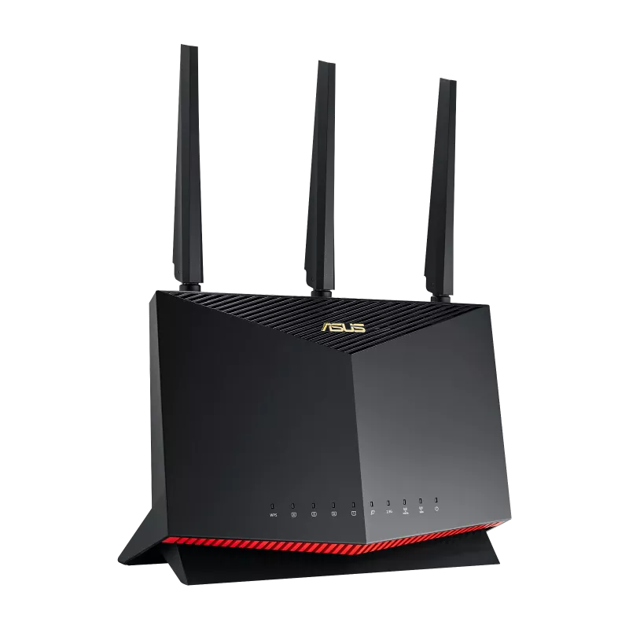
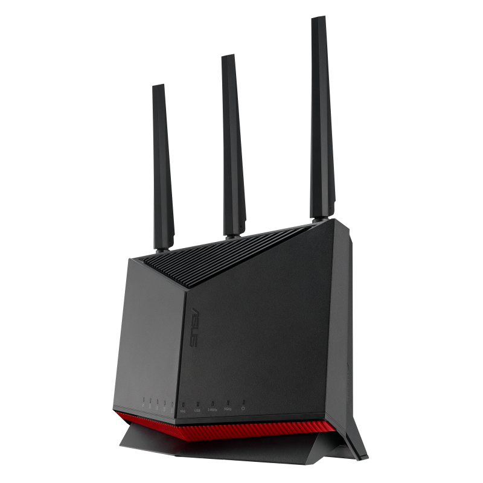
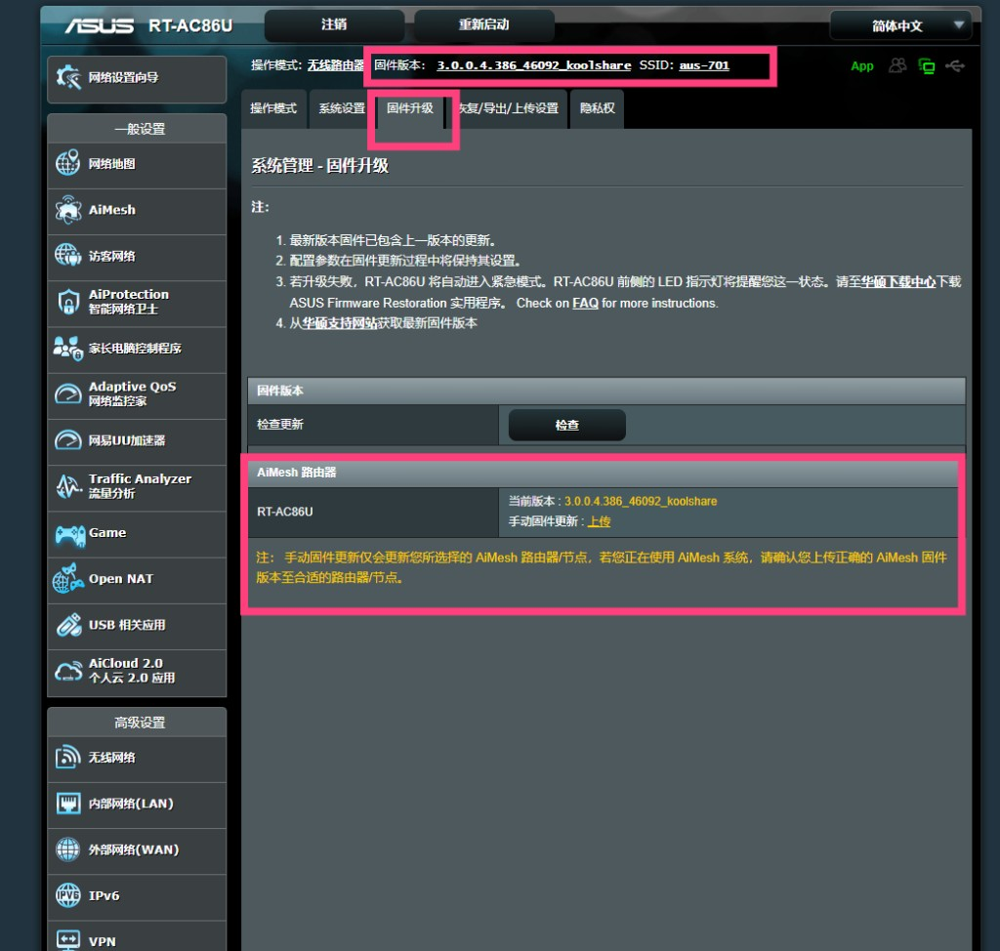
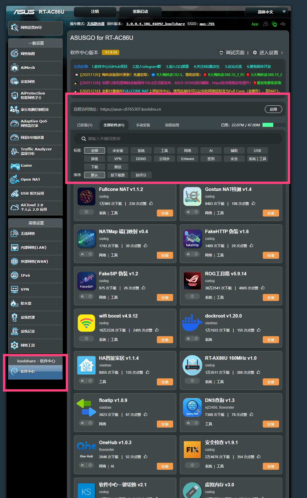

# 华硕路由器翻墙教程 2026 — 梅林固件刷机指南

> 📄 本文对应 HTML 页面：[华硕路由器教程](../docs/pages/asus-router-guide.html)　·　🌐 在线阅读：<https://www.aixiaobai168.com/pages/asus-router-guide>

2026 最新华硕路由器全屋科学上网教程（第 1 部分：刷机）。本文详细介绍如何在华硕路由器上刷入梅林固件，为后续安装 MerlinClash 实现全屋科学上网奠定基础。华硕路由器刷固件流程成熟稳定，操作得当风险较低。

---

## 📋 目录

- [一、硬件选型与推荐](#一硬件选型与推荐)
- [二、固件下载来源](#二固件下载来源)
- [三、刷机前准备](#三刷机前准备)
- [四、刷机步骤详解](#四刷机步骤详解)
- [五、刷机后恢复出厂设置](#五刷机后恢复出厂设置)
- [六、验证固件版本](#六验证固件版本)

---

## 一、硬件选型与推荐

### 1.1 推荐路由器型号与规格对比

| 品牌 | 型号 | CPU | 内存 | 存储 | 价格区间 | 推荐指数 | 备注 |
|------|------|-----|------|------|----------|----------|------|
| 华硕 | RT-AX86U PRO | 博通四核2.0GHz | 1GB | 256MB | 900-1200元 | ⭐⭐⭐⭐⭐ | **推荐首选** |
| 华硕 | RT-BE86U | 博通四核2.6GHz | 2GB | 256MB | 2500-3000元 | ⭐⭐⭐⭐⭐ | Wi-Fi 7旗舰，极致性能 |
| 华硕 | RT-AX88U | 博通四核1.8GHz | 1GB | 256MB | 1200-1500元 | ⭐⭐⭐⭐⭐ | 8个LAN口 |
| 华硕 | RT-AC86U | 博通双核1.8GHz | 512MB | 128MB | 400-600元 | ⭐⭐⭐⭐ | **入门级推荐，性价比之选** |
| 小米 | AX6000 | IPQ5018 | 512MB | 128MB | 400-500元 | ⭐⭐⭐⭐ | 需刷OpenWrt |
| 网件 | R7800 | IPQ8065 | 512MB | 128MB | 300-400元 | ⭐⭐⭐⭐ | 需刷OpenWrt |

### 1.2 最低配置要求

- **CPU**：双核 1.5GHz 或更高
- **内存**：512MB RAM 或更多（推荐 1GB+）
- **存储**：128MB Flash 或更多（推荐 256MB+）
- **网络**：千兆以太网接口
- **固件支持**：支持第三方固件（梅林 / OpenWrt）

### 1.3 华硕 RT-AC86U 入门级推荐

| 规格项目 | 详细参数 | 说明 |
|---------|---------|------|
| **处理器** | 博通双核1.8GHz | 满足日常上网与轻度并发代理 |
| **内存** | 512MB | 入门配置，可运行 MerlinClash |
| **存储** | 128MB Flash | 支持软件中心与常用插件 |
| **无线性能** | Wi‑Fi 5 (802.11ac)，AC2900 | 双频并发，覆盖中小户型 |
| **有线接口** | 1×1G WAN + 4×1G LAN | 适配千兆入户与 NAS 基础需求 |
| **USB接口** | 1×USB 3.0 + 1×USB 2.0 | 外接存储/下载等扩展 |
| **价格区间** | 400-600元 | 入门级高性价比 |

**选择理由**：性价比高、梅林生态成熟、部署简便，适合入门用户与中小户型。

### 1.4 华硕 RT-AX86U PRO 详细规格

| 规格项目 | 详细参数 | 说明 |
|---------|---------|------|
| **处理器** | 博通四核2.0GHz | 支持高并发连接 |
| **内存** | 1GB DDR4 | 充足内存支持 Clash 运行 |
| **存储** | 256MB Flash | 支持安装更多插件 |
| **无线性能** | Wi-Fi 6 (802.11ax)，160MHz | 双频并发 5700Mbps |
| **有线接口** | 1×2.5G (WAN/LAN) + 1×1G WAN + 4×1G LAN | 高速网络连接 |
| **USB接口** | 1×USB 3.2 Gen1 + 1×USB 2.0 | 支持外接存储设备 |
| **价格区间** | 900-1200元 | 性价比极高的高端路由器 |

**选择理由**：性能强劲、梅林固件支持完善、稳定性好、扩展性强。

### 1.5 华硕 RT-BE86U 高端旗舰

| 规格项目 | 详细参数 | 说明 |
|---------|---------|------|
| **处理器** | 博通高性能平台 | 面向 Wi‑Fi 7 高并发场景 |
| **内存** | 1GB+ DDR4 | 适配多插件与并发连接 |
| **存储** | 256MB+ Flash | 支持软件中心与扩展插件 |
| **无线性能** | Wi‑Fi 7 (802.11be) | 更高吞吐、更低时延 |
| **有线接口** | 2.5G 高速口 + 多口千兆 LAN | 满足多千兆宽带/NAS 需求 |
| **USB接口** | USB 3.2 Gen1 | 外接存储/下载等扩展 |

**选择理由**：Wi-Fi 7 前沿技术、高速有线、梅林生态完善，适合高端与重度用户。

---

## 二、固件下载来源

### 2.1 KoolCenter（酷软中心，推荐）

KoolCenter 提供官改与梅林改版固件，适配机型全、更新及时：

- **固件总入口**：[https://fw.koolcenter.com/](https://fw.koolcenter.com/)
- **RT-AX86U PRO**：[KoolCenter RT-AX86U PRO 固件目录](https://fw.koolcenter.com/KoolCenter_Merlin_New_Gen_388/RT-AX86U_PRO/?C=M&O=D)
- **RT-AX86U**：[KoolCenter RT-AX86U 固件目录](https://fw.koolcenter.com/KoolCenter_Merlin_New_Gen_388/RT-AX86U/?C=M&O=D)
- **RT-AX88U PRO**：[KoolCenter RT-AX88U PRO 固件目录](https://fw.koolcenter.com/KoolCenter_Merlin_New_Gen_388/RT-AX88U_PRO/?C=M&O=D)
- **RT-AX68U**：[KoolCenter RT-AX68U 固件目录](https://fw.koolcenter.com/KoolCenter_Merlin_New_Gen_388/RT-AX68U/?C=M&O=D)
- **TUF-AX3000**：[KoolCenter TUF-AX3000 固件目录](https://fw.koolcenter.com/KoolCenter_Merlin_New_Gen_388/TUF-AX3000/?C=M&O=D)
- **TUF-AX5400**：[KoolCenter TUF-AX5400 固件目录](https://fw.koolcenter.com/KoolCenter_Merlin_New_Gen_388/TUF-AX5400/?C=M&O=D)
- **RT-BE86U**：[KoolCenter RT-BE86U 固件目录](https://fw.koolcenter.com/KoolCenter_Merlin_New_Gen_102/RT-BE86U/?C=M&O=D)
- **RT-BE88U**：[KoolCenter RT-BE88U 固件目录](https://fw.koolcenter.com/KoolCenter_Merlin_New_Gen_102/RT-BE88U/)
- **RT-BE96U**：[KoolCenter RT-BE96U 固件目录](https://fw.koolcenter.com/KoolCenter_Merlin_New_Gen_102/RT-BE96U/?C=M&O=D)
- **GT-BE98 PRO**：[KoolCenter GT-BE98 PRO 固件目录](https://fw.koolcenter.com/KoolCenter_Merlin_New_Gen_102/GT-BE98_PRO/)

### 2.2 梅林官方

- **ASUSWRT-Merlin 官网**：[https://www.asuswrt-merlin.net/](https://www.asuswrt-merlin.net/)
- **GitHub 仓库**：[https://github.com/RMerl/asuswrt-merlin.ng](https://github.com/RMerl/asuswrt-merlin.ng)

### 2.3 固件版本说明

| 版本通道 | 说明 | 版本号示例 |
|---------|------|------------|
| **A 系列（官改）** | 官方功能 + 插件支持 | `102.x_y`、`388.x_y` |
| **M 系列（梅林改版）** | 基于 ASUSWRT‑Merlin | 与 A 系列节奏不完全同步 |
| **102.x_\*** | 新平台/新内核，Wi‑Fi 7/BE 及部分 AX 机型 | `102.4_0` |
| **388.x_\*** | Wi‑Fi 6/AX 主线分支 | `388.8_4` |
| **384/386** | 较老分支，老机型保留 | 历史版本 |

**选择建议**：

- 新机或 BE 系列：优先选择 `102.x_*`（如 `102.4_0`）
- AX 机型：有 `102.x_*` 可优先；仅梅林分支时选最新稳定 `388.x_*`（如 `388.8_4`）
- 升级前务必备份配置，并核验 MD5

### 2.4 刷回官方固件入口

如果只是想恢复官方系统，不一定需要复杂救砖流程，通常直接刷回官方固件即可：

- **华硕下载中心**：[https://www.asus.com.cn/support/download-center/](https://www.asus.com.cn/support/download-center/)
- **示例机型页面（RT-AX86U Pro）**：[华硕官方固件下载页](https://www.asus.com.cn/networking-iot-servers/wifi-routers/asus-gaming-routers/rt-ax86u-pro/helpdesk_bios?model2Name=RT-AX86U-Pro)

恢复思路：

1. 打开华硕官方支持页面并搜索你的路由器型号
2. 进入 **驱动程序和工具软件** → **BIOS 与固件**
3. 下载最新官方固件
4. 通过与刷梅林相同的方式上传官方固件
5. 刷回后建议恢复出厂设置，避免旧插件配置残留

---

## 三、刷机前准备

### 3.1 确认路由器型号

确保路由器型号在梅林固件支持列表中，常见型号包括：

- RT-AX88U、RT-AX86U、RT-AX68U、RT-AX86U PRO
- RT-AC86U、RT-AC88U、RT-AC68U
- RT-AX56U、RT-AX58U、RT-AX82U
- TUF-AX3000、TUF-AX5400
- GT-AX6000、GT-AX11000
- RT-BE86U、RT-BE88U 等

### 3.2 备份当前设置

刷机前务必备份路由器配置，以便出问题时恢复：

1. 进入路由器管理界面
2. 进入 **系统管理** → **恢复/导出/上传设置**
3. 点击 **导出** 或 **备份**，将配置文件保存到电脑

### 3.3 下载固件并校验

1. 从 KoolCenter 或梅林官网下载对应机型的固件
2. 使用 MD5 校验工具核对文件完整性（下载页通常提供 MD5 值）
3. 确保固件文件未损坏，避免刷机失败

---

## 四、刷机步骤详解

### 4.1 梅林固件简介

**梅林固件（ASUSWRT-Merlin）** 基于华硕官方固件，专为华硕路由器优化：

- **优点**：稳定性高、保留官方功能、支持插件与脚本、社区活跃、完美支持 Clash
- **缺点**：仅支持华硕路由器，需要一定技术基础
- **适用**：追求稳定性和功能性的华硕用户

### 4.2 第一步：进入路由器管理界面

1. 在浏览器中输入 `http://192.168.50.1` 或 `http://router.asus.com`
2. 使用管理员账号登录（用户名和密码为自行设置）

### 4.3 第二步：固件双清（非新机必做）

若路由器此前已使用过，建议刷机前恢复出厂设置，避免旧配置冲突：

1. 进入 **系统管理** → **恢复/导出/上传设置**
2. 勾选恢复按钮旁的选择框
3. 点击 **恢复** 按钮执行双清

> 若是全新路由器，可跳过此步骤。

### 4.4 第三步：上传梅林固件

1. 进入 **系统管理** → **固件升级**
2. 点击 **选择文件**，选择已下载的梅林固件（.trx 或 .w 等格式）
3. 点击 **上传** 开始刷机

### 4.5 第四步：等待刷机完成

- 刷机过程约 3–5 分钟
- **期间切勿断电或重启路由器**
- 路由器会自动重启，请耐心等待

---

## 五、刷机后恢复出厂设置

刷机完成后，建议再做一次恢复出厂设置，确保新固件在干净环境下运行：

1. 重新登录路由器管理界面（地址可能仍为 `192.168.50.1` 或 `router.asus.com`）
2. 进入 **系统管理** → **恢复/导出/上传设置**
3. 勾选恢复选项，点击 **恢复** 执行恢复出厂
4. 等待路由器自动重启

此步骤可避免旧配置残留导致的异常问题。

---

## 六、验证固件版本

### 6.1 检查固件版本

1. 重新登录路由器管理界面
2. 进入 **系统信息** → **固件版本**
3. 确认显示为梅林固件版本（如 `388.8_4`、`102.4_0` 等）

### 6.2 检查软件中心

梅林固件应包含以下功能：

- **软件中心（Software Center）**
- 更多网络工具
- 高级网络设置
- 自定义脚本支持

若能看到软件中心，说明梅林固件已成功刷入，可继续安装 MerlinClash 插件。

### 6.3 何时考虑刷回官方固件

以下场景可以考虑恢复官方固件：

- 准备转手出售路由器，希望回到原厂状态
- 某个新功能仅官方固件支持，且当前梅林版本未适配
- 长期不再使用插件生态，只想保持最简系统
- 排查异常时，想先回到官方环境做对比测试

---

## 📚 参考资源

- [KoolCenter 固件总入口](https://fw.koolcenter.com/)
- [KoolCenter RT-AX86U PRO 固件目录](https://fw.koolcenter.com/KoolCenter_Merlin_New_Gen_388/RT-AX86U_PRO/?C=M&O=D)
- [KoolCenter RT-BE86U 固件目录](https://fw.koolcenter.com/KoolCenter_Merlin_New_Gen_102/RT-BE86U/?C=M&O=D)
- [华硕官方下载中心](https://www.asus.com.cn/support/download-center/)
- [梅林固件官方 GitHub](https://github.com/RMerl/asuswrt-merlin.ng)
