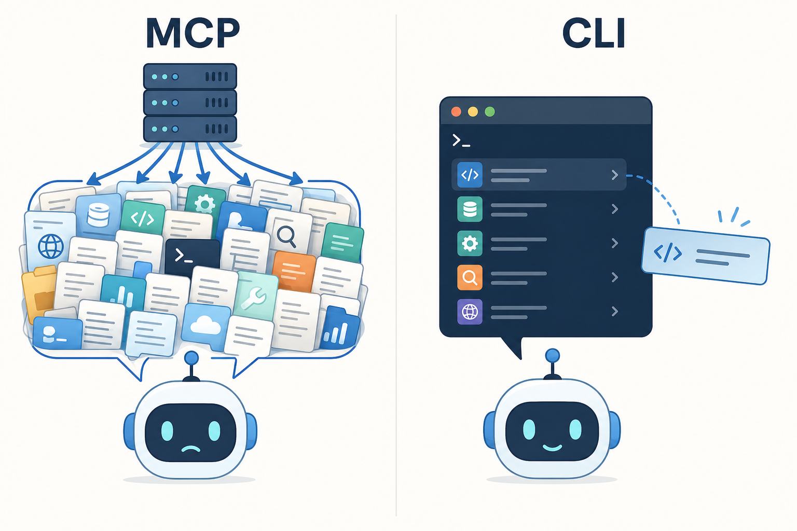
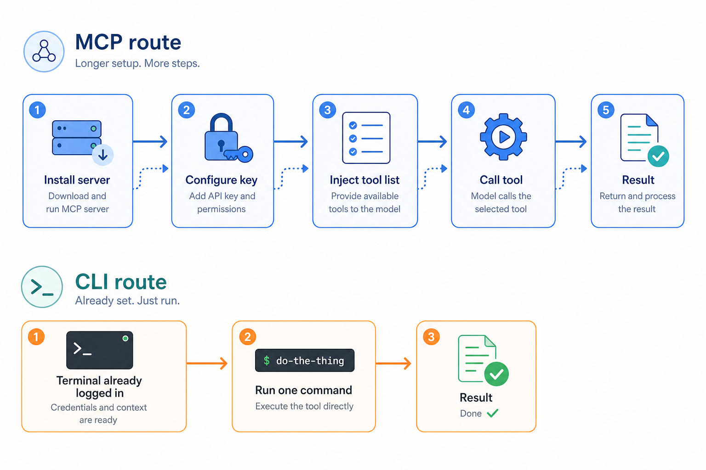

# MCP 没死,但我把大半 Agent 活儿换成了 CLI:Cursor 用户的工具取舍

> 💡 通过邀请链接注册 Cursor，**首月 Pro / Pro+ / Ultra 立享 5 折**：
> [👉 立即注册（首月 5 折）](https://cursor.com/referral?code=Y3RXKKUGMJ2G)

**摘要**：本文厘清 Skill、MCP、CLI 三者的分层关系，复盘半年 Cursor 重度使用后把大半 Agent 执行任务从 MCP 迁移到 CLI 的真实取舍：MCP 的上下文开销、注意力稀释与运维复杂度让日常任务"变重"，而 CLI 的渐进式发现、模型天然熟悉度与管道组合优势让它更适合高频执行任务；同时指出浏览器自动化、结构化返回、权限收口等五类场景应坚持留 MCP。文末给出在 Cursor 里落地这套分工的完整步骤。

**关键词**：Cursor MCP、Cursor CLI、MCP vs CLI、Agent 工具、gh 命令、AGENTS.md、Cursor Agent、上下文开销、工具取舍、CLI 优先

---

## 1. 先把三个词摆清楚:Skill、MCP、CLI 不是同一层的东西

我在刚开始折腾 Cursor Agent 的时候,犯过一个很典型的错误:把这三样东西当成同类选项来比。其实它们根本不在一个维度上。

我现在用来解释它们的类比是:**给 Agent 配工具,像给一个刚入职的聪明新同事配资源。**

**Skill(规则/知识层)** 相当于你给他准备了一份"内部操作手册"。这份手册里写着:我们这个项目有什么约定、危险操作要先确认、代码风格遵循哪个标准、提 PR 之前要跑哪些检查。这个同事会把手册里的规矩记住,以后做事就按这套来。常驻成本极低,消耗的上下文几乎可以忽略。

**MCP(协议接入层)** 相当于你给他办了一批门禁卡和内部系统账号。GitHub、数据库管理后台、云平台控制台——这些系统你提前帮他接好了。每次他需要用某个系统,直接刷卡进去,接口是标准化的。但有一个隐性成本:**每办一张卡,那张卡的说明书——这个系统有哪些功能、每个功能接受什么参数——都得先塞进他的脑子里，不管今天用不用得到。**

**CLI(终端执行层)** 相当于给他配了一台电脑,让他自己开终端敲命令。他本来就会用电脑,不需要你额外教他 git 怎么用、curl 怎么发请求——这些他在学校就学过了,工作语料里也全是。你让他干什么,他自己想好命令,敲进去看结果,不行就换个姿势再试。

**这三层是分层协作的关系,不是互相替代。** Skill 管"懂规矩",MCP 管"接能力",CLI 管"动手干"。一个配置完善的 Agent 工作流,三样可以同时在用——只是不同任务的主力工具不一样。

---

## 2. MCP 到底"贵"在哪里

我说的"贵"不是钱,是上下文开销,以及随之而来的两个副效应。

**先简单过一下 MCP 的运作机制。**

MCP 是 Anthropic 提出的一套客户端-服务端协议,底层走 JSON-RPC。整个流程大概是这样:你启动一个 MCP Server(比如 GitHub 的、数据库的、某个 SaaS 的),Server 初始化完成后,会通过 `tools/list` 这个接口把它能提供的所有工具汇报给 Client——工具名字是什么、每个工具做什么、接受哪些参数、参数是什么类型,全部打包送过来。Client 拿到这份清单,把它注入到当前对话的上下文里。之后每轮对话,模型都能"看到"这些工具定义。当模型决定要用某个工具时,通过 `tools/call` 发起调用。

流程本身设计得很优雅。但代价就藏在"把工具定义注入上下文"这一步里。

**第一层代价:工具定义是全量常驻的。**

不管你今天的任务用不用得到这个 Server 里的某个工具,只要你接了这个 Server,它所有工具的定义就先稳稳占住那块上下文预算。

这个开销有多大?你自己可以去 Cursor 设置里看当前 MCP 工具定义吃掉了多少 token。我的体感是:一个功能稍微丰富一点的 Server——比如 GitHub 的官方 MCP,里面覆盖了 PR、Issue、Review、代码搜索、仓库管理各种操作——光工具清单就相当可观。如果你同时接了三四个这种 Server,上下文窗口里很大一块就被工具说明书占满了,留给真正的任务代码、对话历史和输出的空间就被压缩了。

**第二层代价:注意力稀释。**

上下文里塞了大量和当前任务无关的工具定义,模型在"该用哪个工具"这件事上会变得更容易犯迷糊。这个直觉其实挺好理解:假如你手边摆了 3 把工具,你拿对的概率很高;但如果摆了 30 把,其中还有几把功能描述相近,选错的概率就不是线性上升了。我自己遇到过好几次,Agent 明明可以直接用某个 MCP 工具做事,结果选了另一个参数不对的工具折腾半天。事后翻上下文,发现就是旁边有几个描述相近的工具把它给绕晕了。

我不打算在这儿援引什么精确的准确率数据——各家测试方法不同、结论差异大,你自己在实际任务里的感受比任何第三方数据都更有参考价值。

**第三层代价:运维复杂度。**

每个 MCP Server 是一个独立的进程或者网络服务。启动它需要配置,认证方式各家各异(有的是 API Key 塞环境变量,有的要 OAuth 流程,有的是本地文件 token),偶尔就是起不来——但起不来的原因可能是 Node 版本不对、端口被占、token 过期或者权限不够,要一层一层排查。出问题了你得翻 MCP 的 JSON 日志,有时候错误信息还挺含糊。这种排障链路对于"就想让 Agent 帮我查一下 PR"这种需求来说,实在是太重了。

---

## 3. CLI 为什么对 LLM 格外友好

这是我把大半任务迁到 CLI 的核心原因,展开说一下。



*MCP 把所有工具定义一次性塞进上下文(左);CLI 让 Agent 按需一条条查、用完即走(右)。*

**(a) 渐进式发现,信息按需加载。**

CLI 工具的用法不需要提前全部塞进上下文。Agent 想用 `gh` 做点什么,先跑一下 `gh --help`,看到命令目录;发现自己要的是 PR 相关操作,再跑 `gh pr --help`,看子命令;确定要列出 PR,`gh pr list --help` 看参数。

每次 `--help` 的输出只有几十行,加载的都是当前步骤需要的信息,用完就不占了。这和 MCP"开局把整本手册塞进去"的方式正好相反。对于上下文窗口来说,这个差异非常实在。

**(b) 模型对 CLI 工具天生熟悉。**

LLM 的训练语料里有几十年积累的 Unix 文档、无数 Stack Overflow 问答、海量 shell 脚本和教程。`git`、`curl`、`grep`、`gh`、`docker`、`jq` 这些工具,模型见过太多遍了,不需要你额外教。相比之下,一个私有的 MCP Server 或者小众的 SaaS MCP,模型在训练时可能根本没见过,完全靠你在上下文里提供的工具描述来理解——描述写得模糊,理解就偏。

**(c) 管道组合,天然支持后处理。**

Unix 管道这个设计实在是太好用了。`gh pr list` 出来的结果要按字段筛选?接个 `jq`。要统计行数?接个 `wc -l`。要格式化成表格?接个 `column`。这些后处理不需要 Agent 额外写程序,一个 `|` 就串起来了。

如果是 MCP 返回了一坨结构化数据,Agent 要做后处理,通常得写段代码、存中间变量、再处理——链路更长,出错点也更多。

**(d) 可调试,出错直接复现。**

这一点我自己感触特别深。Agent 用 MCP 调了个接口出错了,你要调试,得看 Client 日志、看 Server 日志、对比 JSON 请求和响应,整个链路是黑盒的。

Agent 用 CLI 跑了条命令出错了,你把那条命令复制到自己终端敲一下,看到的结果和 Agent 看到的完全一样。问题一目了然。这种"我能直接复现 Agent 的视角"的能力,在排查问题时价值极大。

**(e) 生态成熟,工程惯例稳定。**

成熟 CLI 工具有几十年的工程实践积累:退出码 0 代表成功,非 0 代表失败;正常输出走 stdout,错误信息走 stderr;不少现代工具还支持 `--json` 或者 `-o json` 输出机器可读的格式。这些惯例是稳定的,Agent 可以依赖它们做判断,不需要为每个工具单独处理输出格式的特殊情况。

---

## 4. 一个真实的对照:同一个需求,两条路

说说一个我自己真实做过的对照。

**需求很简单**:列出仓库里所有 open 状态的 PR,看看每个人有几条、分别是哪些。



*同一个需求:MCP 路线要走装 Server、配 key、注入工具、调用、拿结果五步;CLI 路线只要"已登录 → 一句命令 → 完成"。*

**路线 A:MCP 方式**

当时我用的是 GitHub 的 MCP Server。步骤大概是:找到 MCP Server 的包、搞清楚认证方式(需要创建一个 Fine-grained token 并给对应仓库权限)、在 Cursor 的 MCP 配置文件里写好 Server 定义、重启 Cursor 让 Server 生效、确认 Agent 能看到工具列表。

整个配置过程花了差不多二十分钟——主要时间在搞 token 权限,GitHub 的 Fine-grained token 权限选项挺细的,一项一项勾。配好以后能用,但上下文里多了一大块 GitHub 工具定义。

**路线 B:CLI 方式**

我本机的 `gh` 之前已经装好并且 `gh auth login` 过了。Agent 模式下,我直接说:"用 gh 列出这个仓库所有 open 的 PR,按作者分组显示"。

Agent 自己组了这条命令:

```bash
gh pr list --state open --json number,title,author \
  --jq 'group_by(.author.login)[] | "\(.[0].author.login): \(map("#" + (.number|tostring))|join(", "))"'
```

跑完,输出直接就是我要的格式。从发出需求到拿到结果,不到一分钟。

如果 `jq` 表达式写错了,我自己在终端把这条命令跑一下,能立刻看到报错信息,改起来也快。

**体感结论:**对于"就这一个需求、本机 `gh` 已经装了"的场景,CLI 这条路配置几乎为零、上下文几乎不占、出错能当场复现。MCP 那条路每一步都是成本,而且配好之后那堆工具定义就常驻了,即便你今天只用了一个"列 PR"的功能。

但我要马上说清楚:**这不代表 MCP 没用,也不代表应该全换成 CLI**。下一节是我认为全文最值钱的部分——真实分工。

---

> 🎁 还没有 Cursor?通过邀请通道注册,**首月 Pro / Pro+ / Ultra 立享 5 折**(Pro 仅需 $10):
> [👉 立即注册（首月 5 折）](https://cursor.com/referral?code=Y3RXKKUGMJ2G)

---

## 5. 我实际怎么分工:不是非此即彼

我现在的分工逻辑大概是这样的。

### 默认走 CLI 的场景

以下这些,我基本不考虑 MCP,直接让 Agent 用 CLI:

- **Git 和 GitHub 操作**:提交、推送、切分支、打 tag、开 PR、合并、查 PR 列表、看 CI 状态——全走 `gh` 和 `git`。这两个工具文档完整、Agent 极其熟悉,几乎不出错。
- **文件批处理**:批量改文件名、按条件筛文件、批量替换文本——`find`/`grep`/`sed`/`awk` 或者 PowerShell 的等价命令。
- **日志排查**:查应用日志、统计错误频次、找特定时间段的记录——`grep -E`、`awk`、`tail -f`。
- **跑测试和构建**:就是敲 `npm test`/`pytest`/`go test`/`make`——没什么特别的。
- **容器操作**:`docker ps`、`docker logs`、`docker exec`——这些 Agent 会。
- **一次性脚本化任务**:把若干条命令串起来做一件事,用完就扔——写成 shell 脚本或者 PowerShell 脚本,跑完存档,下次复用。

这些场景的共同特点是:**有成熟的 CLI 工具、操作是读取或者可以预期的写入、出错成本可控、需要的上下文轻**。

### 我反而坚持留 MCP 的场景

这一块是我觉得那两篇标题党文章说得最不负责任的地方。以下这些场景,我用了 CLI 之后又退回到 MCP,因为 CLI 确实不够用:

**① 根本没有等价 CLI。**

浏览器自动化是最典型的例子。让 Agent 去打开某个页面、点按钮、读取 DOM 里的内容、截图做视觉验证——这件事没有 CLI 能干。你得用 Playwright 的 MCP Server 或者类似的浏览器自动化 MCP。这种场景 CLI 彻底没有替代品,MCP 是唯一出路。

还有一些 SaaS 工具只提供了 API 和 MCP,没有像样的命令行工具——这时候 MCP 也是没得选的选项。

**② 需要稳定的结构化返回。**

有些任务里 Agent 要基于返回结果的某几个字段做判断,比如"如果这次部署的状态是 failed,去取 failure_reason 字段的值再决定下一步"。这种场景需要有 schema 约束的结构化返回——Agent 知道字段名字、类型,取字段直接取,不需要解析自由文本。

MCP 工具的返回是有类型的结构,比 CLI 文本输出稳定得多。有些老命令行工具的输出格式每个版本可能都有细微差异,Agent 解析起来偶尔会翻车。

**③ 跨客户端、跨团队复用。**

如果你在团队里维护一套内部工具——比如封装了部署审批流程、或者数据库的受控查询接口——做成 MCP Server 的好处是:团队里用不同 Agent 客户端的人(有人用 Cursor、有人用 Claude Desktop、有人在用其他 MCP 兼容客户端)都能用同一套接口,权限控制和审计也能集中做。CLI 脚本当然也能共享,但 MCP 在标准化和权限收口这件事上更有优势。

**④ 没有 shell 的运行环境。**

某些沙箱环境、某些 CI 步骤的 Agent 插件、某些受限的远程容器——根本不给你开终端。这时候 MCP 是接入外部能力的唯一方式。

**⑤ 危险操作需要收口和审计。**

如果你把 shell 放开给 Agent,原则上它能干任何事——包括删文件、改配置、把你的数据推到奇怪的地方。对于真正危险的操作,把它封装成 MCP 工具——明确定义这个工具能做什么、参数边界是什么、每次调用有日志——比放开一个无边界的 shell 更可控。

这五类场景,我一个都没有迁到 CLI。

### Skill 放哪层

Skill(也就是 `.cursor/rules` 或者 `AGENTS.md` 里的规则文件)不和 MCP、CLI 抢活,它是完全不同的一层。

Skill 解决的是"让 Agent 懂这个项目的规矩"——用哪种风格提交、危险命令怎么处理、这个仓库有哪些约定、优先用哪些工具。它的开销极轻(几百到几千 token 的规则文本),但收益明显:你不需要每次都在对话里重复交代背景。

Skill 配合 CLI 用是最香的组合:用规则告诉 Agent"本项目优先走 CLI、陌生命令先 `--help` 再执行、涉及删除和修改的命令必须先停下来跟我确认",然后让它用 CLI 动手——规矩在 Skill 里,手脚在 CLI 里。

---

## 6. 在 Cursor 里怎么把这套跑起来

说完为什么,讲讲怎么落地。

### 装 gh 并登录

`gh` 是 GitHub 官方命令行工具,是这套方案里最核心的一块:

```powershell
# Windows(推荐用 winget)
winget install --id GitHub.cli

# 装完验证
gh --version
```

```bash
# macOS
brew install gh
```

装完之后:

```bash
gh auth login
```

按提示选 GitHub 官网、选 HTTPS、用浏览器完成 OAuth 登录。登录完跑一下 `gh auth status` 确认没问题。

这一步必须提前做好,不能指望 Agent 帮你做——认证流程有交互式确认环节,Agent 替不了你。

### 在 Cursor 里配 Agent 的命令执行策略

Cursor Agent 模式自带终端能力,可以直接运行命令。但我强烈建议在设置里把命令的确认策略配清楚:

- **只读/查询类命令**(`gh pr list`、`git log`、`docker ps`、`ls`、`grep`——不改任何状态的):可以放行自动执行。
- **写入类命令**(`git push`、`gh pr merge`、`docker rm`、任何 `rm`/`del`):要求 Agent 在执行前向你展示命令并等确认。
- **不可逆的危险操作**(`git reset --hard`、`docker system prune`、数据库的 `DROP`):直接告诉 Agent 不准自己执行,必须给你看命令让你手动敲。

不要无脑全放行。Agent 给的命令第一次不一定对,特别是在它还没完全搞清楚你的仓库结构的时候。

### 给 Agent 立规矩

在项目根放一份规则文件,我用的是 `AGENTS.md`(纯 Markdown,简单直接;老一点的 Cursor 版本也可以放成 `.cursor/rules/agent-cli.mdc`,注意是 `.mdc` 不是 `.md`)。以下是我自己用的规则模板,可以直接拿去改:

```text
# Agent CLI 操作规范

## 工具优先级
1. 优先使用 CLI 工具(gh、git、docker、curl 等)完成任务
2. 使用前不熟悉的命令,先跑 `<命令> --help` 查看用法再执行
3. 只有 CLI 无法覆盖时,才考虑使用 MCP 工具

## 命令执行规则
- 只读/查询命令可自动执行(gh pr list、git log 等)
- 涉及写入、推送、合并的命令:执行前向用户展示命令并等待确认
- 涉及删除、重置、不可逆操作的命令:禁止自动执行,必须由用户手动确认并执行

## 跨平台注意
- 当前环境是 Windows + PowerShell
- 需要 Unix 命令时,优先找 PowerShell 等价写法
- 不要假设 bash 命令在 PowerShell 里可以直接用

## 输出处理
- 优先在命令里直接用 --json + --jq 或 PowerShell 管道处理输出
- 避免把大量原始输出塞回对话——先过滤再返回相关部分
```

这几条规则写进去之后,Agent 的行为会稳定很多。我自己加了之后,被 Agent 悄悄跑了危险命令的情况基本消失了。

### 把高频操作固化成脚本

这是容易被忽视但很有价值的一步。

当你和 Agent 合作排查过一个问题、或者完成了一个需要多条命令配合的任务,让 Agent 把这次用到的命令整理成可重复运行的脚本,存进 `scripts/` 目录:

```bash
scripts/
  list-open-prs-by-author.sh
  check-ci-status.sh
  cleanup-merged-branches.sh
```

下次有同样需求,一条命令搞定,不用重新教 Agent。Agent 也可以把它们作为工具来调用,而不是每次从头组命令。把一次性经验固化成可复用工具,这是整套方案里投入产出比最高的操作。

---

## 7. CLI 不是银弹:几个我踩过的坑

既然讲工具取舍,就得把 CLI 的坑也讲清楚,不然就成了另一篇方向相反的标题党。

**写入操作有副作用,失误了不一定能回滚。**

`git push --force` 是 Agent 如果理解错了需求很可能给出的命令。`docker system prune` 会清掉你所有没用的容器和镜像。文件删除更是直接的。Agent 组命令的思路不一定和你的完全一致——在你完全信任一条命令之前,自己读一遍,特别是带 `--force`、`-f`、`-r` 这类 flag 的。

我的习惯是:凡是有副作用的命令,我都在自己终端先 dry-run 一下,或者把命令参数再对一遍,确认没问题再执行。

**有些操作 CLI 也需要交互式确认,Agent 替不了你。**

`gh auth login`、很多包管理器的首次安装、交互式的 `git rebase -i`——这些流程里有交互式步骤,等你输入、等你在浏览器里点确认。Agent 跑到这一步会卡住,它没办法替你按键。你需要自己接手,把交互式的部分做完,让 Agent 接着往下。

**Windows + PowerShell 的跨平台坑。**

这个在 Windows 上用 Cursor Agent 跑命令的时候很高频出现,单独说一下。

最典型的坑之一:`sc` 命令。在 bash/zsh 环境里 `sc` 可能什么都不是,但在 PowerShell 里 `sc` 是 `Set-Content` 的别名。如果 Agent 想用 `sc.exe`(Windows 的服务控制工具),它得显式写 `sc.exe`——不然 PowerShell 会把它当成 `Set-Content` 执行,结果会很奇怪。

类似的坑还有:`ls` 在 PowerShell 里是 `Get-ChildItem` 的别名,输出格式和 Unix `ls` 完全不同,`ls -la` 这种 flag 在 PowerShell 里是不认的。`rm -rf` 在 PowerShell 里也得改写成 `Remove-Item -Recurse -Force`。

我在规则文件里专门加了一条"当前环境是 Windows + PowerShell"来提醒 Agent,效果明显——它会主动给出 PowerShell 写法而不是 bash 写法。如果你也是 Windows 用户,这一条强烈建议加上。

**文本输出解析不稳定。**

有些老旧命令行工具的输出格式不是为机器解析设计的——列宽会随内容变化、字段之间用空格而不是分隔符、不同版本的输出格式可能略有差异。Agent 解析这种输出写的代码,有时候在你本地跑好的,换一台机器因为工具版本不同就挂了。

遇到这种情况,老老实实上 `--json` 输出。大多数现代工具都支持。如果工具实在没有结构化输出选项,这反而是用 MCP(如果有对应 MCP Server)的好理由——第 5 节说的第二种场景。

---

## 小结:分层,不是决赛

回到最开始那个问题:MCP 死了吗?

没有。它解决了一类 CLI 解决不了或者解决得很别扭的问题。

但对我自己的日常 Agent 工作流来说,**把常用执行任务迁到 CLI 是一次非常值得的重构**——更轻、更快、更透明、更容易调试。MCP 退到了它最擅长的位置:无 CLI 等价物的能力接入、需要结构化返回的复杂场景、需要权限收口的危险操作。

分层是关键词,不是非此即彼:

- **Skill(规则层)**:把项目约定和操作规范喂给 Agent,让它懂规矩;常驻、轻量。
- **CLI(执行层)**:高频、简单、可探索的日常任务;按需、透明、可调试。
- **MCP(能力接入层)**:无 CLI 等价物、需要结构化/跨端复用/权限收口的场景;按需接入,不乱堆。

如果你现在想把这套方案在自己的项目里跑起来,4 件事优先级最高:

1. **装 `gh` 并完成登录**。这是成本最低、收益最快的一步,装完你的 Agent 就能处理绝大多数 GitHub 工作流。
2. **给 Agent 立 `--help` 优先的规则**。在规则文件里写明"陌生命令先 `--help` 查用法再执行",能避免很多 Agent 因为参数猜错搞出意外的情况。
3. **涉及写入和删除的命令,要求 Agent 先展示再执行**。无论如何,先看一眼,这个习惯值得养成。
4. **把高频排查操作固化成 `scripts/` 里的脚本**。第一次合作解决了某个问题,让 Agent 整理成脚本存起来——下次直接用,经验变工具。

"2026 年最值得搭的 Agent 干活方式"——CLI + 一层薄薄的规则,MCP 按需补位。不追标题党,按场景选工具。

---

## 相关教程

- [Cursor 国内使用完整教程](../cursor-guide.md)
- [Cursor SSH 远程开发](./cursor-ssh-linux.md)
- [Cursor + 阿里云 ECS 部署 Node.js 应用](./cursor-aliyun-deploy.md)
- [Cursor + GitHub Pages 上线静态站](./cursor-build-static-site.md)

---

### 🎁 准备开始用 Cursor？

通过邀请通道注册，**首月 Pro / Pro+ / Ultra 立享 5 折**——Pro 仅需 $10、Pro+ 仅需 $30、Ultra 仅需 $100。

[👉 立即开通（首月 5 折）](https://cursor.com/referral?code=Y3RXKKUGMJ2G)

> 邀请通道仅对首月生效，次月起恢复原价；可随时取消订阅。

<!-- char count: 待统计 -->
