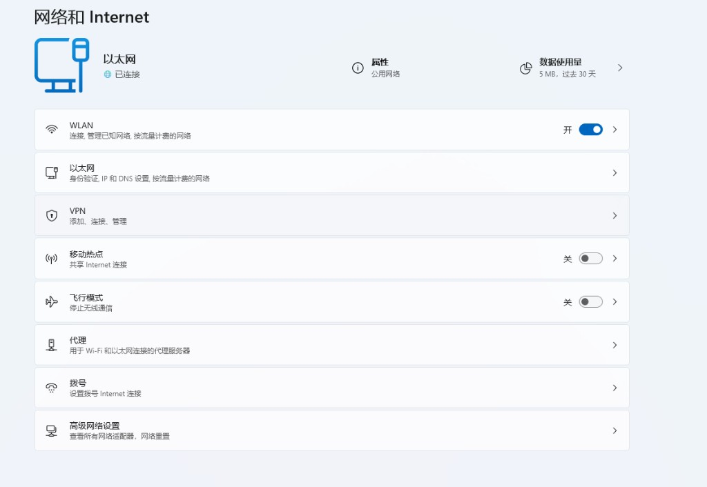
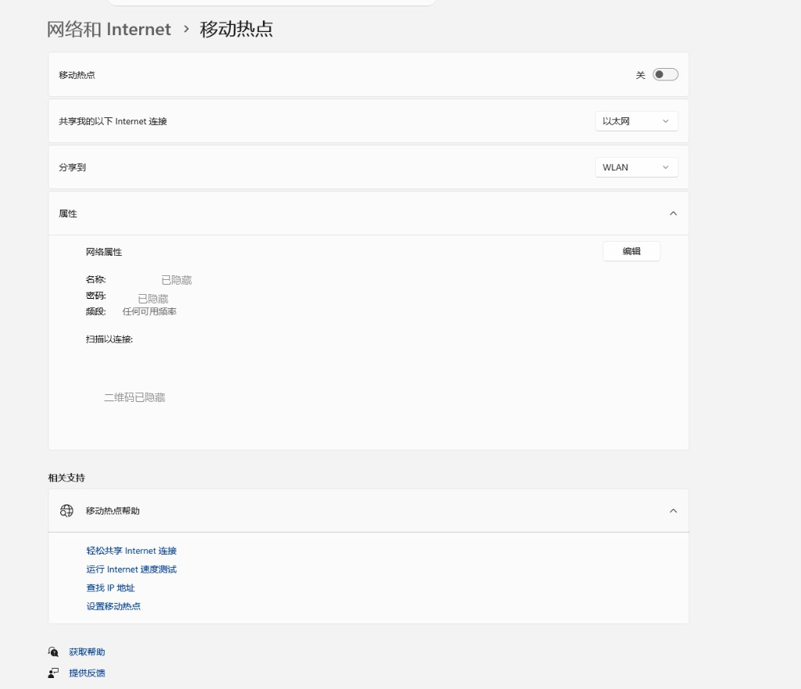

# iPhone 外区 Apple ID + 电脑热点破局教程

> 📄 本文对应 HTML 页面：[iPhone 海外 Apple ID + 电脑热点教程](../docs/pages/apple-id-hotspot-guide.html)　·　🌐 在线阅读：<https://www.aixiaobai168.com/pages/apple-id-hotspot-guide>

电脑和手机都零基础、都没有任何翻墙方式时，iPhone 自己无法同时跨过「注册外区 Apple ID」和「下载 ShadowClash」这两处卡点。本文给出唯一现实的解法：电脑先跑通 Clash，开热点让手机连上同一网络，再用 **局域网代理**（而不是热点 + TUN 全局模式，更稳定不易冲突）把手机流量接进代理，一次性跨过注册和下载。

---

## 📋 目录

- [一、问题说明：为什么 iPhone 自己破不了局](#一问题说明为什么-iphone-自己破不了局)
- [二、电脑先破局：跑通 Clash](#二电脑先破局跑通-clash)
- [三、地区怎么选：五地区对比 + 节点是否要对齐](#三地区怎么选五地区对比--节点是否要对齐)
- [四、电脑开热点 + 配置代理，图文步骤](#四电脑开热点--配置代理图文步骤)
- [五、iPhone 连热点后注册外区 Apple ID](#五iphone-连热点后注册外区-apple-id)
- [六、仍在热点网络下下载 ShadowClash](#六仍在热点网络下下载-shadowclash)
- [七、美区 Apple ID 实际付费怎么办（进阶，可选）](#七美区-apple-id-实际付费怎么办进阶可选)
- [八、安全提醒](#八安全提醒)
- [九、常见问题 FAQ](#九常见问题-faq)

---

## 一、问题说明：为什么 iPhone 自己破不了局

> 💡 **先看这条**：如果你手机当前能连上的某个 Wi-Fi 本身已经是翻墙状态（不限于家里路由器，随身路由器、朋友的热点等都算），可以直接跳过下面「电脑破局 + 开热点」这一大段，从 [第五节「注册 Apple ID」](#五iphone-连热点后注册外区-apple-id)开始操作即可。

零基础的 iPhone 要拿到一个能下载 ShadowClash 的外区 Apple ID，中间存在两处相互叠加的卡点：

- **卡点一：注册环节**。在 appleid.apple.com 注册时，付款方式的「无 / None」选项能否出现，和当前网络 IP 被识别为哪个地区直接相关；如果设备网络仍是国内 IP，这个选项可能直接消失，或者地区在注册过程中被系统打回中国大陆（或其他非目标地区）。
- **卡点二：下载环节**。即使账号已经注册成功、地区正确，甚至已经在 App Store 登录了这个外区账号，下载 ShadowClash 这个动作本身仍然需要设备当前处于翻墙状态——App Store 的下载请求同样会判断设备当前所在的网络地区，不是账号地区对了就万事俱备。

这两处卡点叠加的结果是：iPhone 在没有任何外网能力时，无法靠自己同时跨过「注册」和「下载」。唯一现实的解法是借道电脑——电脑不受 App Store 地区限制，可以先把代理跑通，再把这个已经翻墙的网络通过热点分享给 iPhone，让手机借着这个临时网络一次性完成注册和下载。

---

## 二、电脑先破局：跑通 Clash

电脑客户端（Clash Verge Rev / ClashX Meta）可以直接从 GitHub 或本站下载，不受 App Store 地区限制，也不需要先有外区账号。配合一份机场订阅，电脑可以独立跑通代理，这是整条链路的起点。

- Windows 用户：安装步骤见 [Windows 翻墙教程](../windows/clash-verge-rev.md)（[在线版](https://www.aixiaobai168.com/pages/windows-guide)）
- macOS 用户：安装步骤见 [macOS 翻墙教程](../macos/clashx-meta.md)（[在线版](https://www.aixiaobai168.com/pages/macos-guide)）
- 还没有机场订阅：先看 [Clash 订阅申请指南](../subscription/clash-subscription-guide.md)

> ⚠️ 本节不重复展开安装细节，只强调这一步是前提：先确认电脑上的 Clash 已经能正常连接、能打开外网页面，再往下进行「开热点」这一步，否则热点分享出去的仍然是没有翻墙的网络，没有意义。

---

## 三、地区怎么选：五地区对比 + 节点是否要对齐

### 1. 五个常用地区对比

下面五个地区目前均支持大陆 +86 手机号接收验证码，均可以在付款方式里选择「无 / None」跳过绑卡：

| 地区 | +86 手机号收码 | 「无」付款方式 | 说明 |
|------|---------------|---------------|------|
| **台湾（推荐）** | ✅ | ✅ | 大陆手机号识别度最高、社区案例最多、地址模板成熟，ShadowClash 等主流客户端均有上架 |
| 香港（不推荐） | ✅ | ✅ | 可能命中港区限定版应用、部分应用功能受限 |
| 美国 | ✅ | ✅ | 应用上架最全，但地址模板和识别度不如台湾成熟 |
| 日本 | ✅ | ✅ | 可用，社区案例相对少 |
| 新加坡 | ✅ | ✅ | 可用，社区案例相对少 |

**结论**：优先推荐 **台湾**；**不推荐香港**，因为香港地区偶尔会命中港区限定版应用或功能受限的情况。选定要注册的地区后，记得把 Clash 的节点组也切到对应地区（例如注册台湾 ID 就把节点切到台湾）。

### 2. 节点地区要不要和 Apple ID 地区一致

「无」付款方式选项能否出现，和当前网络 IP 的地区归属直接相关。如果你注册的是台湾地区，但节点却挂在其他地区，容易出现「无」选项消失，或者注册中途被系统打回国区的情况。

- **建议顺序**：先把 Clash 节点组切到目标地区，再打开注册页面，全程保持该地区节点
- 下载完成、账号不再需要之后，日常使用节点可以切回任意其他地区，不影响已经注册好的 Apple ID
- **注册过程中途不要频繁切换节点 IP**，这会触发设备指纹不一致，容易导致注册失败或被要求重新验证

---

## 四、电脑开热点 + 配置代理，图文步骤

电脑上的 Clash 跑通之后，这一步分两部分：先开热点让手机连上同一网络，再选一种方式让手机的流量真正走代理——**推荐用「局域网代理」**，比「热点 + TUN 全局模式」更稳定，不会跟 Windows 移动热点冲突。

### 第一步：电脑开热点，让手机连上同一网络

#### Windows 11（移动热点）

1. 打开 **设置** → **网络和 Internet**，找到「移动热点」入口

   

2. 进入「移动热点」页面，「共享我的以下 Internet 连接」选择 **以太网**（有线网卡）
3. 「分享到」选择 **WLAN**
4. 展开「属性」，点击「编辑」设置网络名称和密码（下图名称/密码/二维码为演示已打码，实际以自己电脑显示的为准）

   

5. 打开顶部「移动热点」开关

> 💡 **Windows 10 用户注意**：菜单路径相同（**设置 → 网络和 Internet → 移动热点**），但界面样式是旧版列表式，没有 Win11 这种可展开的「属性」卡片，选项直接平铺显示「共享我的 Internet 连接来源」「共享方式」等，操作逻辑一致，用 **以太网** 做来源、**Wi-Fi** 做共享方式即可。
>
> ⚠️ **Windows 10 常见问题：找不到「移动热点」或开关一直灰色**，通常是虚拟网卡没启用，可按顺序排查：
>
> 1. 右键开始菜单打开 **设备管理器** → 菜单栏「查看」勾选「显示隐藏的设备」→ 展开「网络适配器」，找到被禁用的 **Microsoft Wi-Fi Direct 虚拟适配器**（或类似名称），右键启用
> 2. 仍不行可改走经典入口：**控制面板 → 网络和共享中心 → 更改适配器设置**，右键以太网 → 属性 → 「共享」标签页，勾选「允许其他网络用户通过此计算机的 Internet 连接来连接」，并在下拉框里选中 Wi-Fi 适配器
> 3. 确认无线网卡驱动已更新到厂商最新版本，部分老旧网卡驱动不支持虚拟热点

#### macOS（互联网共享）

1. 打开 **系统设置** → **通用** → **共享** → **互联网共享**
2. 「共享来源」选择 **以太网**
3. 「对以下设备开放」勾选 **Wi-Fi**
4. 点击 Wi-Fi 选项，设置网络名称和密码
5. 打开互联网共享开关

### 第二步：选一种方式，让手机流量真正走代理

光连上热点还不够——热点本身只是让手机和电脑在同一个网络里，手机的流量要真正经过 Clash 代理出去，还需要下面两种方式里选一种。

> ✅ **方式一（推荐）：局域网代理**，稳定、不依赖 TUN、不会和热点冲突：
>
> 1. Clash 客户端里打开「**允许局域网连接 / Allow LAN**」（Clash Verge Rev 在设置页，ClashX Meta 在菜单栏选项里），并记下当前的 **混合端口**（Clash Verge Rev 默认 `7897`，ClashX Meta 默认 `7890`，以客户端实际显示为准）
> 2. 手机连上热点后，进入这个 Wi-Fi 的详情页，找到「路由器」/网关地址（Windows 移动热点默认是 `192.168.137.1`），记下这个 IP
> 3. 点「配置代理」→ 选 **手动** → 服务器填上一步的网关 IP，端口填 Clash 的混合端口
> 4. 保存后用 Safari 打开一个外网页面测试，能打开就说明代理已经生效
>
> ⚠️ **方式二（备选，进阶）：TUN 全局模式**——电脑热点和 Clash 的 TUN 模式一起开，手机不用配置任何代理，连上热点即自动全局代理，省去手动填服务器/端口的步骤。**但这个组合经常和 Windows 移动热点（ICS）冲突**：表现为手机连上热点、能拿到 IP，却完全没有网络（无网络图标、任何网页都打不开），而电脑自己上网完全正常——这是因为 TUN 模式抢占了系统默认路由，把本该转发给热点客户端的流量劫持走了。**如果遇到这种情况，直接改用上面的「局域网代理」方式**，不需要继续排查 TUN 配置。

---

## 五、iPhone 连热点后注册外区 Apple ID

跨过卡点一。iPhone 连上电脑的热点之后，**只在 Safari 里打开** <https://appleid.apple.com/account/create> 网页注册，**不要在「设置」App 里直接创建/登录新 Apple ID**——原因见下面的关键提醒。以下是需要注意的要点：

- **不需要当地手机号**：大陆 +86 手机号即可接收验证码，前面五个地区通用
- **不需要信用卡**：付款方式选择「无 / None」即可跳过绑卡
- **一个手机号最多绑定 2 个 Apple ID**：绑满后系统会提示该手机号不可用，需要换一个手机号或使用已有账号
- **收不到验证码时**：先检查短信拦截或垃圾短信分类，确认手机已完成实名登记；仍收不到可以换一个邮箱重试（优先 Gmail、Outlook），并避免使用虚拟号码接收验证码
- **没有「无」付款方式选项时**：常见原因是地区选错了（比如误选了中国大陆或香港，实际想要的是台湾），需要重新注册；也可能是当前网络没有真正处于目标地区节点下，刷新或重新进入注册页面通常能解决。相比去修改现有 Apple ID 的国家地区，新建一个目标地区的账号更稳妥
- **地址模板**：不需要填写真实的当地住址，用通用模板（城市、邮编等）即可，系统不做实地核查
- **注册完只登录 App Store，不登录 iCloud**：iOS 系统设置里没有独立的"App Store"菜单，正确入口是——如果手机当前没有登录任何 Apple ID（设置顶部显示"登录 iPhone"），直接打开 **App Store 这个 App**，点右上角头像图标登录新账号即可，天然不会碰到 iCloud；如果手机已经登录了原来的账号，走「设置 → [你的名字] → 媒体与购买项目 → 退出登录」，再重新点一次「媒体与购买项目」选择登录新账号，这一步只影响 App Store / Apple Music 等媒体购买服务，同样不涉及 iCloud 同步（注意 iOS 26.4 起 App Store App 内自带的退出登录按钮被移除了，只能走"设置"这条路径）

> 🛑 **致命陷阱：iCloud 的"云上贵州"提示会把账号永久打回大陆**——如果登录 iCloud 时弹出"数据存储由云上贵州大数据产业发展有限公司运营"的同意框，一旦点了同意，这个 Apple ID 会被服务器端标记为中国大陆 iCloud 账号，国家/地区随之改成中国，**基本无法挽回**。这也是为什么强烈建议只用 Safari 网页注册（不会自动帮你登录 iCloud），并且只通过 App Store App 本身或「媒体与购买项目」单独登录：见到任何 iCloud 登录提示、尤其是"云上贵州"字样，一律拒绝或跳过。如果已经点了同意，这个账号大概率救不回来了，直接放弃、重新注册一个更省事。

---

## 六、仍在热点网络下下载 ShadowClash

跨过卡点二。

> 🛑 **关键提醒**：下载完成前不要断开热点，如果用的是「局域网代理」方式，也不要提前关掉手机 Wi-Fi 里配置好的代理。账号地区只是下载的前提之一，下载这个动作本身仍然需要设备当前处于翻墙状态。

用新注册的外区 Apple ID 登录 App Store 后，搜索 **ShadowClash**（App Store ID 6760091330，开发者 FUZZYPN COMPANY LIMITED，完全免费），点击「获取」下载即可。下载完成、打开 ShadowClash 并成功导入订阅、连接生效之后，才可以断开对电脑热点的依赖。

ShadowClash 详细的使用步骤（Guest mode、Add Profile、导入订阅 URL 等）本文不重复展开，一步一步的图文教程见：[手机教程 · ShadowClash 使用教程](ios-shadowrocket.md#四shadowclash-使用教程免费方案推荐)（[在线版](https://www.aixiaobai168.com/pages/mobile-guide#ios-3)）。

---

## 七、美区 Apple ID 实际付费怎么办（进阶，可选）

本文主体流程只涉及 **免费** 下载 ShadowClash，用「无 / None」付款方式就够了，不需要看这一节。但如果你以后想在美区实际买付费 App、订阅或买美区独占内容，就需要一个能真正扣款的付款方式，这里单独说清楚——这个场景比"免费下载"复杂得多，风险也高得多。

### 国内双币 / 全币种信用卡直接绑定？不推荐

Apple 官方支持社区已经明确说过：美区 App Store 只能添加美国发行的银行卡，国内的 Visa 卡是无法添加的。具体卡在三层：

- **发卡地区（BIN，卡号前 6 位）不匹配**：Apple 会校验发卡行所在国家，不只是看卡组织是不是 Visa/Mastercard，国内双币/全币种卡的卡头仍然是中国大陆
- **账单地址 + 邮编校验**：即使卡号验证通过，真正扣款时会比对账单地址（含 ZIP code）与发卡行记录是否一致，填美国地址但发卡行记录是国内地址，会直接被拒
- **国内银行跨境风控与美区支付流程不兼容**：国内银行遇到大额/首次跨境交易常要求短信验证码二次确认，但美区 App Store 支付页面不会弹出国内银行的验证流程，交易会直接超时失败

社区实测数据可以佐证这种"能绑上、付不出"的现象（数据来自第三方实测博客，非 Apple 官方数据，仅供参考，实际情况会随银行风控策略变化）：

| 付款方式 | 绑定成功率 | 实际付款成功率 |
|---|---|---|
| 国内双币/全币种信用卡 | 约 80% | 约 25% |
| 中国区 PayPal 账户 | 约 90% | 约 0% |
| Apple 官方礼品卡充值 | 约 100% | 约 100% |

> ⚠️ **常见误区提醒**：不少攻略会推荐用 Wise 等跨境支付工具办一张美元虚拟卡来绑定美区 Apple ID，但这条路对大中华区用户实际走不通。Wise 官方帮助文档明确列出的发卡地区只有澳大利亚、巴西、加拿大、欧洲经济区+瑞士、日本、马来西亚、新西兰、菲律宾、新加坡、英国及其海外领地、美国（内华达州除外）——**中国大陆、香港、澳门、台湾均不在发卡范围内**，官方文档甚至写明用户若搬到香港，名下现有的 Wise 卡会被自动封锁。也就是说，大中华区用户在 Wise 只能开户、持有外币余额、做跨境收付款，**拿不到卡**，别把时间浪费在这条路上。

### PayPal 路径：技术可行，但关键是账户注册国家，不是卡

Apple 官方最新的付款方式支持列表（<https://support.apple.com/en-us/HT202631>）确认：**PayPal 确实是美区 Apple ID 官方支持的付款方式**（美国、加拿大、英国、澳大利亚、以色列，以及多数西欧国家都支持）。但有个容易被忽略的关键点：

- **Apple 校验的是 PayPal 账户本身注册的国家/地区，不是你在 PayPal 里绑的那张卡的发卡国**。用国内 Visa 双币卡做 PayPal 账户的资金来源验证，这一步技术上通常没问题——PayPal 走的是国际卡组织清算网络，不太看重卡发行国和 PayPal 账户注册国家是否一致
- 但如果 PayPal 账户注册时选的国家是「中国」，即使卡验证通过，实际用于美区 Apple ID 支付时会因为「PayPal 账户国家与 Store 地区不一致」被直接拒绝——PayPal 账户注册国家必须是美国（或 Apple 支持列表里的其他地区），才能匹配美区 Store 的要求

> ⚠️ **风险提示**：用非本人真实居住地的地址去注册"美区个人 PayPal 账户"，本身涉嫌违反 PayPal 用户协议里"账户注册地应与实际居住地一致"的条款，存在账户被审核、限制甚至资金被冻结的风险。这不是零风险的稳妥方案，属于灰色操作，需要自行评估能不能接受这个风险。

### 更稳妥的替代路径

- **Apple 官方礼品卡（Gift Card）充值**：通过支付宝小程序、淘宝等渠道购买美区 Apple 礼品卡（人民币/银联结算），充值到 Apple 账户余额，用余额消费订阅或买 App，完全不涉及信用卡地区匹配问题，是大中华区用户 **唯一稳定可靠、成功率最高、风控风险最低** 的方式，缺点是不能自动订阅扣款、需要手动充值。务必认准正规渠道购买卡密，避免小网站/来路不明的渠道

> 💡 **一句话总结**：只想免费下载 ShadowClash，用「无」付款方式就够了，不用管这一节；真要在美区实际付费，别硬绑国内信用卡，也别信"办张 Wise 卡就能搞定"的说法（大中华区根本办不到这张卡），优先选 Apple 官方礼品卡充值；PayPal 路径原理上可行但涉及账户注册地的合规风险，请自行评估。

---

## 八、安全提醒

- 不要购买淘宝、群里来路不明的 **共享台区 Apple ID**，账号可能随时被找回或封禁
- 不要把 Apple ID 密码告诉任何人
- 台区（或其他外区）Apple ID 建议仅用于 App Store 下载，**不要登录 iCloud**；遇到"云上贵州"数据存储同意框务必拒绝，否则账号地区会被永久改回中国大陆
- App 只从 App Store 官方渠道安装，不要使用第三方签名或破解版

---

## 九、常见问题 FAQ

### 1. 只是切换到外区 Apple ID，是不是就能直接下载 App 了？

不一定。账号地区只是下载的前提之一，下载这个动作本身仍然需要设备当前处于翻墙状态，即便账号已经是外区，如果设备当前的网络还是国内网络，下载依然可能失败。

### 2. 电脑和手机都没有任何翻墙方式，要怎么开始？

先在电脑上装好 Clash Verge Rev（Windows）或 ClashX Meta（macOS）并配合机场订阅跑通代理，再把这台电脑的网络通过热点分享给 iPhone。推荐用 **局域网代理**（打开 Clash 允许局域网连接，手机手动配置代理指向电脑网关和混合端口）而不是热点 + TUN 全局模式，前者更稳定不易冲突。iPhone 借着这个临时网络完成 Apple ID 注册和 ShadowClash 下载，之后就不再需要依赖电脑热点。详见本文 [第二节](#二电脑先破局跑通-clash) 和 [第四节](#四电脑开热点--配置代理图文步骤)。

### 3. 台湾、香港、美国选哪个地区？

优先推荐台湾：大陆手机号识别度最高、社区案例最多、地址模板成熟，ShadowClash 等主流客户端均有上架；不推荐香港，可能命中港区限定版应用、功能受限。美国、日本、新加坡也可用，但社区经验不如台湾丰富。

### 4. 注册中途能不能换节点？

不建议。注册中途频繁切换节点 IP 会触发设备指纹不一致，容易导致注册失败或被要求重新验证。建议先把 Clash 节点组固定切到目标地区，注册完成前不要切换。

### 5. 一个手机号最多能绑定几个 Apple ID？

同一个手机号最多绑定 2 个 Apple ID，绑满后系统会提示该手机号不可用于新账号，需要更换手机号或使用已绑定的账号。

### 6. 收不到 Apple 验证码怎么办？

先检查短信拦截或垃圾短信分类，确认手机号已完成实名登记；如果仍收不到，可以换一个邮箱重试（优先 Gmail、Outlook），并避免使用虚拟号码接收验证码。

### 7. 注册时没有出现「无 / None」付款方式选项怎么办？

常见原因是地区选错（比如误选了中国大陆或香港，实际想要的是台湾），需要重新注册；也可能是当前网络没有真正处于目标地区节点下，刷新或重新进入注册页面通常能解决。与其去修改现有 Apple ID 的国家地区，新建一个目标地区的 ID 更稳妥。

### 8. 热点连不上、手机搜不到 Wi-Fi 怎么办？

先确认电脑的移动热点（Windows）或互联网共享（macOS）开关已经打开，且共享来源选择了正确的有线网卡；确认电脑本身能上网后，再重新进入手机 Wi-Fi 设置页面看一次，有时列表刷新会有延迟。

### 9. 为什么下载这一步也要连着热点，不能先注册完断开再下载？

因为 App Store 的下载请求同样会判断设备当前所在的网络地区，注册完成只是解决了账号地区问题。如果下载时已经断开热点、恢复国内网络，下载环节仍然可能因为网络地区不符而失败。所以建议下载完成、订阅导入并连接生效后，才断开热点。

### 10. Windows 10 找不到「移动热点」选项，或者开关一直是灰色的？

Windows 10 上这个功能同样在 **设置 → 网络和 Internet → 移动热点**，只是界面样式比 Win11 老一些。如果找不到入口或开关点不开，通常是虚拟网卡没启用：先去设备管理器里显示隐藏设备，检查「网络适配器」下是否有被禁用的 Wi-Fi Direct 虚拟适配器并启用；不行的话改走经典控制面板的「网络和共享中心 → 更改适配器设置 → 以太网属性 → 共享」勾选允许其他用户连接；也可以顺手更新一下无线网卡驱动。详见本文[第四节](#四电脑开热点--配置代理图文步骤)。

### 11. 手机连上电脑热点后完全没有网络（连图标都不显示），电脑自己上网却正常，是怎么回事？

这是 Clash 的 **TUN 全局模式和 Windows 移动热点（ICS）冲突** 的典型表现：TUN 会抢占系统默认路由，把本该转发给热点客户端（手机）的流量劫持走，导致手机连上热点却完全没有网络，而电脑自己走 Clash 进程处理的流量不受影响。遇到这种情况不用继续排查 TUN 配置，直接改用[第四节](#四电脑开热点--配置代理图文步骤)里的「局域网代理」方式：关掉 TUN，打开 Clash 的「允许局域网连接」，在手机 Wi-Fi 详情里手动配置代理指向电脑的网关 IP 和 Clash 混合端口即可，这个方式不依赖 TUN，不会有这个冲突。

### 12. 注册好台湾（或其他外区）Apple ID 后，手机弹出"云上贵州"数据存储提示，点了同意账号就变成中国大陆了，怎么办？

这个提示只在 **登录 iCloud** 时才会出现，和网络是否翻墙无关——只要点了同意，这个 Apple ID 就会被服务器端标记为中国大陆 iCloud 账号，国家/地区随之改成中国，基本无法挽回。常见触发原因是在「设置」App 里直接创建/登录新 Apple ID（这个入口会顺带自动登录 iCloud）。正确做法是 **只用 Safari 网页注册**（<https://appleid.apple.com/account/create>），注册完不要走「设置」顶部的账号登录入口：手机没登录过任何 Apple ID 的话，直接在 App Store App 里点头像登录新账号；已经登录了原账号的话，走「设置 → [你的名字] → 媒体与购买项目 → 退出登录」切换到新账号，这条路径只影响 App Store 等媒体购买服务，全程不碰 iCloud 登录；如果中途弹出任何 iCloud 登录或"云上贵州"提示，一律拒绝/跳过。已经点了同意的账号基本救不回来，直接放弃重新注册一个更省事。

### 13. 美区 ID 想买付费 App，能不能直接用国内的 Visa 信用卡付款？

不建议，大概率绑得上但付不出。Apple 官方支持社区确认美区 App Store 只能添加美国发行的银行卡：国内双币/全币种卡的卡头（BIN）仍是中国大陆，绑定时可能通过初步验证，但实际扣款会因账单地址/邮编与发卡行记录不匹配、或国内银行跨境风控短验与美区支付流程不兼容而失败。详见本文[第七节](#七美区-apple-id-实际付费怎么办进阶可选)。

### 14. 能不能用国内信用卡验证一个 PayPal 账号，再用这个 PayPal 给美区 ID 付款？

思路方向没问题，但关键不在卡，而在 PayPal 账户注册的国家。用国内 Visa 卡验证 PayPal 账户的资金来源，技术上通常没问题；但 Apple 校验的是 PayPal 账户本身注册的国家是否和 Store 地区一致——如果 PayPal 账户注册国是中国，即使卡没问题，支付也会被拒绝（中国区 PayPal 绑定成功率高但实付成功率几乎为 0）。要让 PayPal 在美区 Apple ID 上能用，PayPal 账户注册国必须是美国，但这涉及用非本人真实居住地地址注册 PayPal 的合规风险，账户可能被审核或限制。更稳妥的替代方案是 Apple 官方礼品卡充值（Wise 等跨境支付工具不对大中华区用户发卡，这条路走不通），详见本文[第七节](#七美区-apple-id-实际付费怎么办进阶可选)。

---

## 相关链接

- [手机翻墙完整教程（ShadowClash / Shadowrocket / Stash）](ios-shadowrocket.md)
- [Clash 订阅申请指南](../subscription/clash-subscription-guide.md)
- [Windows Clash Verge Rev 教程](../windows/clash-verge-rev.md)
- [macOS ClashX Meta 教程](../macos/clashx-meta.md)
