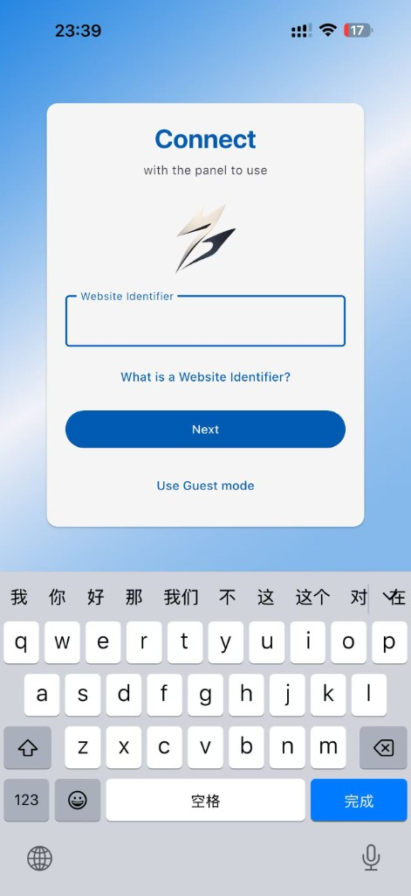
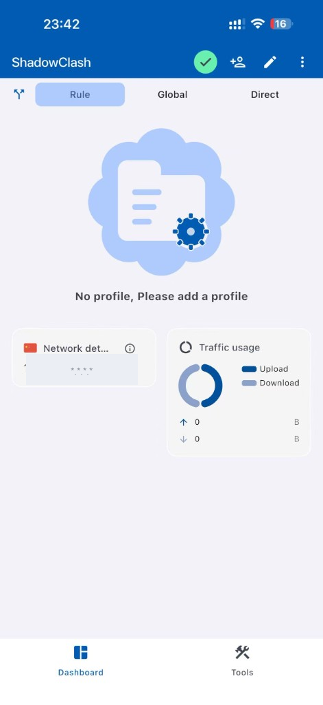
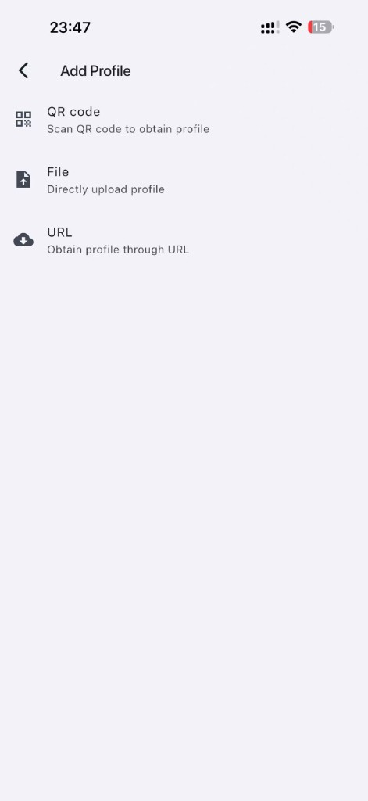

# 手机怎么科学上网 2026 — iOS ShadowClash / Shadowrocket / Stash 翻墙教程

> 📄 本文对应 HTML 页面：[手机教程](../docs/pages/mobile-guide.html)　·　🌐 在线阅读：<https://www.aixiaobai168.com/pages/mobile-guide>

2026 最新 iPhone / iPad 科学上网教程。本文指导您在 iOS 上使用 **ShadowClash（免费）**、Shadowrocket、Stash 等 Clash 客户端配合机场订阅实现科学上网，并提供一条「美国 Apple ID + ShadowClash + 蓝胖云」的低成本路径，以及与「一键 VPN App」省事方案的取舍对比。

---

## 📋 目录

- [一、iOS 翻墙工具概述](#一ios-翻墙工具概述)
- [二、获取外区 Apple ID](#二获取外区-apple-id)
- [三、购买与下载](#三购买与下载)
- [四、ShadowClash 使用教程（免费方案推荐）](#四shadowclash-使用教程免费方案推荐)
- [五、Shadowrocket 使用教程](#五shadowrocket-使用教程)
- [六、Stash 使用教程](#六stash-使用教程)
- [七、「一键 VPN」App 与 Clash 客户端怎么选](#七一键-vpnapp-与-clash-客户端怎么选)
- [八、按需连接](#八按需连接)
- [九、分流规则](#九分流规则)
- [十、最低成本 iOS 翻墙路径总结](#十最低成本-ios-翻墙路径总结)
- [十一、常见问题](#十一常见问题)

---

## 一、iOS 翻墙工具概述

### 主流工具对比

| 应用 | 价格 | 内核 | 特点 | 适用人群 |
|------|------|------|------|----------|
| **ShadowClash** | **免费** | Clash | 开发者 FUZZYPN，**App Store 隐私白皮书明示不收集任何数据**；Guest mode 直接 URL 导入订阅；无广告、无强制订阅 | 新手 / 零成本入门 |
| **Shadowrocket** | $2.99（一次性买断） | 自研 + Clash 兼容 | 功能全面、支持协议最多、社区教程多 | 进阶 / 老用户 |
| **Stash** | $3.99（一次性买断） | Clash | 规则分流配置最贴近 Clash 桌面版 | 偏好 Clash 桌面体验 |
| **Quantumult X** | $7.99（一次性买断） | 自研 | 重写 / 复写规则等高级特性多 | 折腾型进阶 |

> 💡 三款付费 App 都是 **一次性买断**（不是订阅制），下载到外区 Apple ID 后永久所有，重装也能找回。

### 重要说明

**所有上述应用均需从非中国大陆区的 App Store 下载**。中国区 App Store 不提供这些应用，因此您需要：

1. 注册或使用外区（如美区、港区）Apple ID
2. 在 App Store 中登录该 Apple ID
3. 下载（ShadowClash 完全免费 / 其他三款一次性付费）

> 💡 **一键 VPN App 和 Clash 客户端适合不同人群**。前者更省事，适合不想研究订阅、规则和节点的新手；后者配置略多，但可控性、价格和可迁移性更好。选择前建议先看本文 [第七节](#七一键-vpnapp-与-clash-客户端怎么选) 的对比。

---

## 二、获取外区 Apple ID

### 方法一：在网页上注册新 Apple ID（推荐）

1. **打开注册页面**
   - 在电脑浏览器中访问：<https://appleid.apple.com/account/create>
   - 或使用手机浏览器访问（需开启「桌面版网站」）

2. **填写个人信息**
   - 姓名：可填写真实姓名或昵称
   - 国家/地区：选择 **美国** 或 **香港**（推荐美区，应用更全）
   - 出生日期：需填写年满 18 岁的日期
   - 邮箱：使用未注册过 Apple ID 的邮箱（如 Gmail、Outlook）
   - 密码：至少 8 位，含大小写字母和数字

3. **验证邮箱**
   - 提交后，Apple 会向您的邮箱发送验证码
   - 输入验证码完成验证

4. **支付方式**
   - **美国区**：可选择「无」或添加 Visa/Mastercard 信用卡
   - **香港区**：可选择「无」或添加信用卡
   - 若选择「无」，部分付费应用需通过 **礼品卡** 充值后购买

5. **完成注册**
   - 按提示完成剩余步骤即可

### 方法二：使用礼品卡

若无法绑定信用卡，可购买对应地区的 Apple 礼品卡：

- **美区礼品卡**：可在亚马逊、淘宝等渠道购买（注意选择正规渠道）
- 充值后，App Store 余额会显示为美元，可用于购买应用

### 注意事项

- 一个邮箱只能注册一个 Apple ID
- 国家/地区一旦选定，**更改较麻烦**，建议选择美区或港区
- 请妥善保管 Apple ID 和密码，勿与他人共享

**仅仅切换到外区 Apple ID 并不代表马上就能下载**——注册和后续下载这两步，都需要设备当前处于翻墙状态。账号地区只是下载的前提之一，不是充分条件：如果注册时设备联网环境不是目标地区，「无」付款方式选项可能消失；即便账号注册成功，下载 App 这个动作本身也会判断设备当前所在的网络地区，不是账号地区对了就万事俱备。

如果你的电脑和手机目前都没有任何翻墙方式，完整的破局步骤（电脑先跑通 Clash → 开热点分享给 iPhone → 注册 Apple ID → 下载）请看：[iPhone 海外 Apple ID + 电脑热点教程](apple-id-hotspot-guide.md)。

---

## 三、购买与下载

### 1. 切换 App Store 账号

1. 打开 **设置** → **App Store**
2. 点击顶部的 Apple ID
3. 选择 **退出登录**
4. 再次打开 App Store，点击右上角头像
5. 选择 **使用其他 Apple ID**，输入您的外区 Apple ID 和密码

### 2. 搜索并购买

1. 在 App Store 中搜索 **Shadowrocket** 或 **Stash**
2. 点击「获取」或价格按钮（如 $2.99）
3. 按提示完成购买（需绑定支付方式或使用礼品卡余额）
4. 下载完成后，应用会出现在主屏幕

### 3. 下载后即可切换回原 Apple ID

- 购买完成后，可在 **设置** → **App Store** 中切换回您的中国区 Apple ID
- 已购买的应用会保留在设备上，不会因切换账号而消失
- 更新应用时，需重新登录购买该应用的外区 Apple ID

---

## 四、ShadowClash 使用教程（免费方案推荐）

ShadowClash 是 iOS 上完全免费的 Clash 兼容客户端，对新手最友好，也是本教程推荐的首选方案。

### 1. 信任背书与基本信息

| 项目 | 信息 |
|------|------|
| **App Store ID** | 6760091330 |
| **开发者** | FUZZYPN COMPANY LIMITED（香港公司） |
| **隐私政策** | <https://fuzzypn.com/privacy.html> |
| **价格 / 内购** | 完全免费、**无广告、无内购、无强制订阅** |
| **数据收集** | App Store 隐私白皮书明示「**开发者不会从此 App 收集任何数据**」（Apple 强制公示） |
| **支持平台** | iOS / iPadOS 13.0+、Apple Vision、Apple Silicon Mac |
| **更新频率** | 持续维护（截至撰写时最新版本 1.3，2026-04-12） |
| **上架地区** | 美区、港区、中国区等多区均可下载 |

> ℹ️ ShadowClash 本身是闭源软件，所以建议：**机场订阅链接含账号信息，请妥善保管，不要分享给他人**。

### 2. 下载安装

1. 切换到外区（推荐美区）Apple ID，方法见本文 [第二节](#二获取外区-apple-id) 与 [第三节](#三购买与下载)
2. 在 App Store 搜索 **ShadowClash**，点击「获取」直接下载（不需要付款）
3. 下载完成后，App 会出现在主屏幕

### 3. 首次启动：选 Guest mode 即可

打开 App 会看到 **Connect with the panel to use** 输入框，要求填 **Website Identifier**：

- **Website Identifier** 是机场（如蓝胖云）官方面板的"站点标识符"，**填了就需要登录机场账号同步订阅**
- **新手最简方式**：直接点击下方的 **Use Guest mode**（访客模式），跳过这一步，用订阅 URL 手动导入

### 4. 导入订阅（蓝胖云为例）

进入 Guest mode 后，主界面会提示 `No profile, Please add a profile`：

1. 点击右上角的 **+人形** 或 **铅笔** 图标进入 **Add Profile** 页面
2. 三种导入方式任选其一：

   

   | 方式 | 适用场景 |
   |------|---------|
   | **QR code** | 机场后台直接生成订阅二维码时使用 |
   | **File** | 手头已有 `.yaml` 配置文件 |
   | **URL**（**推荐**） | 粘贴疾风云 / 扬帆云 / 蓝胖云等机场后台「我的订阅」复制的订阅链接 |

3. 选 **URL** → 粘贴订阅链接 → 给 Profile 起个名字（如 `lanpang`）→ 完成
4. 回到主界面会看到 Profile 已加载，左上角箭头图标可切换 Profile

> 💡 蓝胖云 **New_2026** 系列入门档月付 ¥10/月（168GB / 3 设备同时在线）就够 iPhone + 备用机用了，详见 [Clash 订阅申请指南 · 蓝胖云](../subscription/clash-subscription-guide.md#32-蓝胖云)。

### 5. 连接与三种模式

主界面顶部的 **Rule / Global / Direct** 切换，逻辑与所有 Clash 客户端一致：

| 模式 | 行为 | 推荐场景 |
|------|------|---------|
| **Rule**（默认） | 按订阅自带规则分流：国内直连、国外走代理 | 日常使用 |
| **Global** | 所有流量走代理 | 临时调试、强制走代理时 |
| **Direct** | 所有流量直连 | 暂时关代理但不退出 App |

第一次连接时 iOS 会弹「添加 VPN 配置」，点 **允许** + 输入设备密码即可。状态栏出现 `VPN` 图标即代表成功。

### 6. 选节点与延迟测试

- 主界面下方的 **Tools** 标签 → 进入策略组（Proxy group），可看到机场提供的所有节点
- 每个策略组支持 **逐组延迟测试**，点一下就会自动 ping 出每个节点的当前延迟
- 蓝胖云常用节点参考延迟：香港直连 75-110ms / 日本直连 84-102ms / 美国 250-400ms（详见订阅指南）

### 7. ShadowClash 优劣总结

| 优点 ✅ | 局限 ⚠️ |
|--------|--------|
| 完全免费、无广告、无内购弹窗 | 闭源，不能审计代码 |
| App Store 隐私白皮书明示不收集数据 | 高级配置（如复杂规则改写）不如 Stash 灵活 |
| Guest mode 极简，新手 30 秒上手 | 评分样本少（中国区 12 评，香港区不足显示） |
| 多区上架 + 持续更新 | 仅英文界面 |

---

## 五、Shadowrocket 使用教程

> 适合愿意一次性付 $2.99 换更全协议支持和更成熟社区教程的用户。

### 1. 添加订阅

1. 打开 **Shadowrocket**
2. 点击底部 **配置**（Config）或 **设置**（Settings）
3. 点击右上角 **+** 或 **添加**
4. 选择 **URL** 或 **订阅**
5. 粘贴您的订阅链接
6. 点击 **确定** 或 **保存**

### 2. 更新订阅

- 在配置列表中，左滑该配置 → 选择 **更新**
- 或点击配置右侧的刷新图标

### 3. 连接代理

1. 在主界面，点击顶部的 **连接开关** 或 **大按钮**
2. 首次连接时，系统会弹出「添加 VPN 配置」提示
3. 点击 **允许** 并输入设备密码（若需要）
4. 连接成功后，状态栏会显示 VPN 图标

### 4. 选择节点

1. 在 **配置** 标签中，确保已选中您的订阅
2. 点击底部 **首页** 或 **代理** 标签
3. 在节点列表或策略组中选择要使用的节点
4. 点击即可切换

### 5. 规则模式

- **配置**：使用订阅中的规则
- **全局代理**：所有流量走代理
- **直连**：所有流量直连

---

## 六、Stash 使用教程

### 1. 添加配置

1. 打开 **Stash**
2. 点击底部 **配置**（Config）或 **设置**
3. 点击 **从 URL 下载**
4. 粘贴订阅链接
5. 点击 **下载** 或 **确定**

### 2. 选择策略组

- Stash 基于 Clash 内核，支持策略组（如「自动选择」「节点选择」）
- 在 **代理** 或 **首页** 中，选择要使用的策略组和节点

### 3. 连接

1. 点击主界面的 **连接** 按钮
2. 授予 VPN 权限
3. 连接成功后即可使用

### 4. 与 Shadowrocket / ShadowClash 区别

- **Stash** 偏向 Clash 桌面老用户，规则配置最贴近 `clash-meta` 桌面行为
- **Shadowrocket** 支持协议最多、兼容性最广，付费 App 中社区教程最多
- **ShadowClash** 则是三者中唯一免费的，新手最简单
- 三者均可使用同一机场订阅链接，互不冲突，可同时安装择优使用

---

## 七、「一键 VPN」App 与 Clash 客户端怎么选

App Store 里的「一键连接」类 VPN App 并不一定都不能用。它们的优点是简单：下载、订阅、点连接，基本不需要理解订阅链接、规则分流、节点选择这些概念。对于只是偶尔临时使用、愿意为省事付费的人，这类 App 确实有存在价值。

但它和 ShadowClash / Shadowrocket / Stash 这类 Clash 客户端不是同一种方案。区别主要在于：

| 维度 | 一键 VPN App | Clash 客户端 + 订阅 |
|------|--------------|---------------------|
| 上手难度 | 最简单，通常注册后点连接即可 | 需要导入订阅、理解 Rule / Global / Direct |
| 费用形式 | 多为月付 / 年付订阅，注意自动续费 | 客户端一次性或免费，节点服务单独购买 |
| 节点与规则 | 服务商封装好，用户少折腾 | 可选择节点、规则、策略组，控制更细 |
| 可迁移性 | 通常只能在该 App 内使用 | 同一订阅可在手机、电脑、路由器复用 |
| 适合人群 | 想省事、不想研究配置 | 想控制成本、跨设备使用、精细分流 |

选择时重点看三点：

- 是否支持试用或短周期月付，不建议一上来年付。
- 是否能清楚看到价格、续费周期和取消订阅入口。
- 是否接受“不能导入自己的机场订阅、节点由 App 服务商管理”这一点。

我们的建议是：如果只是偶尔使用、希望越简单越好，可以选择口碑较好的一键 VPN App；如果你愿意多花 10 分钟配置，想要更低成本和更高可控性，优先选择 **ShadowClash / Shadowrocket / Stash + 机场订阅**。

---

## 八、按需连接

### 1. 始终连接 vs 按需连接

| 模式 | 说明 | 适用场景 |
| ---- | ---- | -------- |
| **始终连接** | 打开应用后需手动连接 | 默认模式，按需使用 |
| **按需连接** | 在特定 Wi-Fi 下自动连接 | 如在家或公司 Wi-Fi 自动开代理 |

### 2. 设置按需连接（Shadowrocket / ShadowClash 同理）

1. 打开 **设置** → **按需连接** 或 **On Demand**
2. 添加 Wi-Fi 网络：选择「仅在以下 Wi-Fi 下连接」
3. 输入 Wi-Fi 名称（SSID）
4. 保存后，连接该 Wi-Fi 时会自动开启代理

### 3. 使用场景

- **在家**：若路由器已部署 Clash，可关闭手机代理，或设置「在家 Wi-Fi 不自动连接」
- **出门**：使用移动网络或公共 Wi-Fi 时，手动连接或设置「按需连接」

---

## 九、分流规则

### 1. 内置规则

- ShadowClash、Shadowrocket、Stash 等应用通常内置常用分流规则
- 默认规则：国内直连，国外走代理
- 一般无需额外配置即可使用

### 2. 从 URL 导入规则集

若订阅未包含规则，或需自定义规则：

1. 进入 **规则** 或 **Rule** 设置
2. 选择 **从 URL 添加** 或 **规则集**
3. 粘贴规则集链接（如 `https://example.com/rules.yaml`）
4. 保存后，应用会按规则分流

### 3. 自定义规则

- 支持添加自定义规则：如 `DOMAIN-SUFFIX,google.com,Proxy`
- 格式：`类型,匹配内容,策略`
- 可指定某域名走代理或直连

> 需要让微信直连国内服务器、其他应用保持原规则或继续走代理时，建议参考单独整理的图文教程：[ShadowClash 微信直连国内服务器设置教程](shadowclash-wechat-direct.md)。

### 4. 规则优先级

- 规则从上到下匹配，先匹配的规则优先生效
- 建议将自定义规则放在靠前位置

---

## 十、最低成本 iOS 翻墙路径总结

如果你只想用最低的钱、最少的步骤把 iPhone 配通，按下面顺序操作即可。这是一条**已经被验证可用**的完整路径。

> ⚠️ **必看提示**：如果你当前设备（电脑和手机）都没有任何翻墙方式，下面第 1-3 步做不了——需要先看 [iPhone 海外 Apple ID + 电脑热点教程](apple-id-hotspot-guide.md) 完成注册 Apple ID + 下载 ShadowClash，再回到本节继续第 4 步开始的订阅配置。

### 步骤与成本

| 步骤 | 操作 | 一次性成本 | 持续成本 |
|------|------|----------|---------|
| 1 | 参考 [iPhone 海外 Apple ID + 电脑热点教程](apple-id-hotspot-guide.md) 免费注册一个外区 Apple ID（付款方式选「无」，不花钱） | 0 | — |
| 2 | iPhone 切到该外区 Apple ID（设置 → App Store → 退出 → 用美区 ID 重新登录） | 0 | — |
| 3 | App Store 搜索 **ShadowClash** 下载（**完全免费，不要付费、不要绑卡**） | 0 | — |
| 4 | 在「蓝胖云」注册并购买入门档 New_2026 套餐（168GB / 3 设备同时在线） | — | **¥10 / 月**（年付更便宜，可降到 ¥120/年） |
| 5 | 蓝胖云后台「我的订阅」复制订阅 URL → ShadowClash → Guest mode → Add Profile → URL → 粘贴 | 0 | — |
| 6 | 主界面切换到 **Rule** 模式 → 点连接 → 允许 VPN 配置 → 完成 | 0 | — |

**首月总成本：¥10（仅订阅费，Apple ID 免费注册）**；之后每月仅 ¥10 订阅费，年付摊下来 ¥10/月以下。

### 必看提示

- ✅ **整条路径不需要任何信用卡**（包括美国 Apple ID 和 ShadowClash 都不要求绑卡）
- ✅ **ShadowClash 完全免费**：在 App 内看到任何"升级到高级会员"弹窗都直接关掉，不影响功能
- ✅ Apple ID 与机场账号是**两套独立账号**：Apple ID 只用来下载 App，节点服务来自机场订阅
- ⚠️ 妥善保管 Apple ID 密码 + 蓝胖云订阅链接（**订阅链接含账号信息，不要分享他人**）
- ⚠️ 若需要在 iPhone 与 iPad / Mac 上同时使用，注意机场套餐的「设备同时在线数」上限

### 该方案涉及的服务

- 蓝胖云套餐对比：[Clash 订阅申请指南 · 蓝胖云](../subscription/clash-subscription-guide.md#32-蓝胖云)
- ShadowClash App Store：<https://apps.apple.com/us/app/shadowclash/id6760091330>

---

## 十一、常见问题

### 1. 中国区 App Store 找不到应用

**现象**：搜索 Shadowrocket、Stash 等无结果（**ShadowClash 在中国区目前可见**，但部分时段也可能下架）。

**原因**：这些应用通常未在中国区上架，或合规策略变动后被下架。

**解决**：

- 必须使用外区（美区、港区等）Apple ID 登录 App Store 后下载，参考 [第二节](#二获取外区-apple-id)。

### 2. 切换 Apple ID 区域需谨慎

**现象**：想将中国区 Apple ID 改为美区。

**注意**：

- 切换区域需清空余额、取消订阅等
- 若账号有未到期订阅，可能无法切换
- 建议**单独注册外区 Apple ID**，而非修改现有账号

### 3. 订阅格式兼容性

**现象**：导入订阅后无法使用或节点不显示。

**解决**：

- ShadowClash、Stash 主要支持 Clash 格式（YAML）
- Shadowrocket 支持更多格式：Clash、SS、SSR、V2Ray 等
- 若订阅链接返回的是 Clash 格式，三者均可使用
- 若为其他格式（如纯 SSR / V2Ray 链接），可优先尝试 Shadowrocket
- 大多数主流机场（蓝胖云、疾风云、尔湾云等）默认提供 Clash 订阅，三个客户端都能直接用

### 4. 耗电问题

**现象**：开启代理后电量消耗明显增加。

**解决**：

- 代理会持续运行，占用一定电量是正常现象
- 不使用时及时断开连接
- 可开启「按需连接」，仅在特定网络下自动连接
- 避免长时间开启「全局代理」模式

### 5. 连接后无法上网

**现象**：显示已连接，但无法打开网页。

**解决**：

- 检查订阅是否已正确加载并包含有效节点
- 尝试切换节点或规则模式
- 确认规则是否正确（国内直连、国外代理）
- 重启应用或重启设备后重试

### 6. VPN 配置数量限制

**现象**：iOS 对 VPN 配置数量有限制，可能影响多应用使用。

**解决**：

- 进入 **设置** → **通用** → **VPN 与设备管理**
- 删除不用的 VPN 配置
- 保留正在使用的 ShadowClash / Shadowrocket / Stash 配置即可

### 7. ShadowClash 弹"升级到高级会员"该不该买？

**现象**：偶尔会看到付费升级弹窗。

**说明**：

- ShadowClash 本身**完全免费**，所有核心功能（订阅、规则、节点切换、TUN 模式）都不需要付费
- 弹窗里的"高级会员"是开发者的可选支持项，**不买不影响任何功能**
- 直接点关闭按钮即可，不影响导入订阅和连接
- 如果遇到其他 App 需要先订阅才能使用，先确认价格、续费周期和取消订阅入口，再决定是否购买；更详细的取舍见 [第七节](#七一键-vpnapp-与-clash-客户端怎么选)

### 8. 外区 Apple ID 注册成功后，是不是就能直接下载 App 了？

**现象**：账号已经显示是外区、也在 App Store 登录了，但下载失败或搜不到。

**说明**：

- 不一定。下载这一步本身也需要设备处于翻墙网络下，账号地区只是前提之一，不是充分条件
- App Store 的下载请求同样会判断设备当前所在的网络地区，如果设备当前联网环境还是国内网络，即使账号地区正确，下载依然可能失败

### 9. 电脑和手机都没有翻墙方式，要怎么开始？

**现象**：手边电脑和手机都是零基础，没有任何现成的翻墙网络可用。

**解决**：

- 电脑不受 App Store 地区限制，可以直接从 GitHub 或本站下载 Clash Verge Rev / ClashX Meta，配合机场订阅先跑通代理
- 再把电脑的网络通过热点分享给 iPhone，iPhone 借这个临时网络一次性完成 Apple ID 注册和 ShadowClash 下载
- 完整步骤见 [iPhone 海外 Apple ID + 电脑热点教程](apple-id-hotspot-guide.md)

---

## 相关链接

- [ShadowClash App Store（美区）](https://apps.apple.com/us/app/shadowclash/id6760091330)
- [ShadowClash 开发者隐私政策](https://fuzzypn.com/privacy.html)
- [Shadowrocket 官网](https://shadowrocket.app/)（需外网访问）
- [Stash 官网](https://stash.wiki/)（需外网访问）
- [Clash 订阅申请指南（含疾风云、扬帆云、蓝胖云等机场）](../subscription/clash-subscription-guide.md)
- [iPhone 海外 Apple ID + 电脑热点教程](apple-id-hotspot-guide.md)
- [项目主页](../../README.md)
