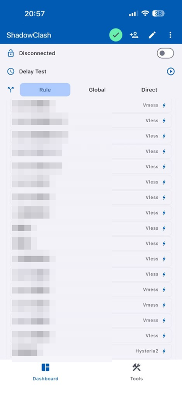
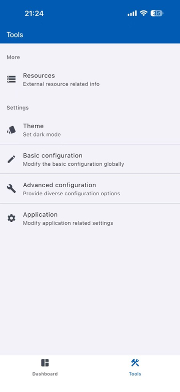
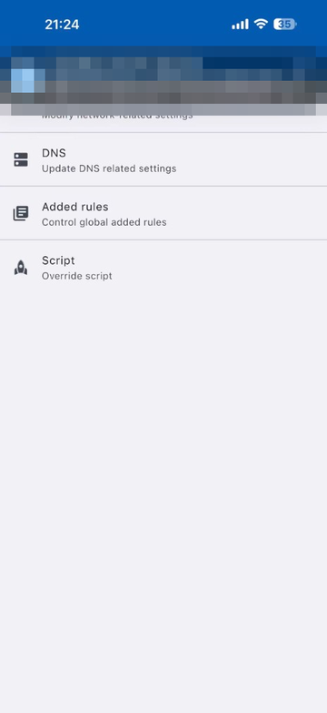
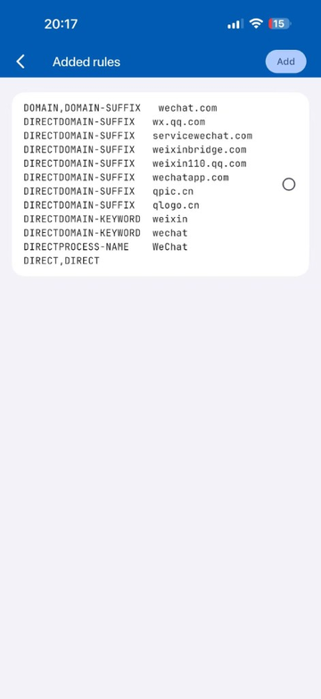
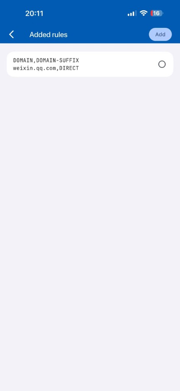
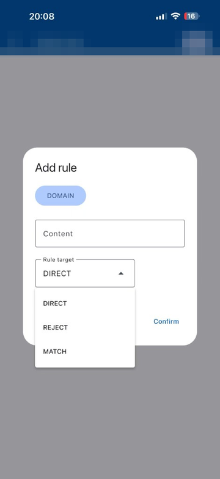
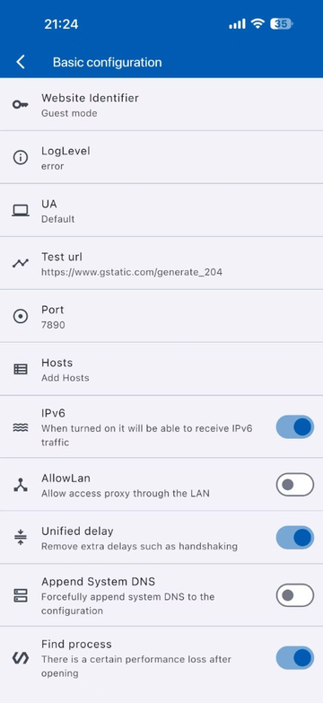
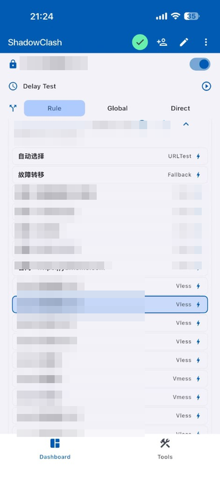
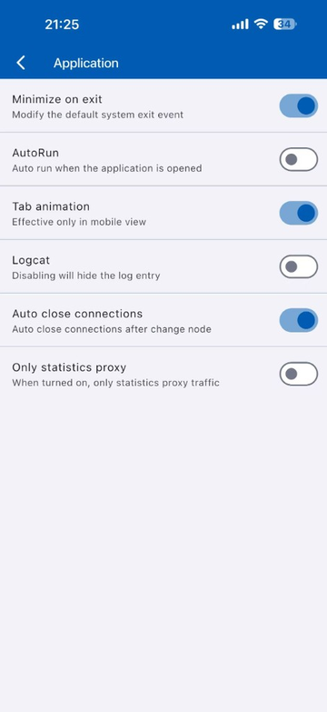

# ShadowClash 微信直连国内服务器设置教程

<!-- markdownlint-disable MD033 -->

> 适用场景：iPhone / iPad 上使用 ShadowClash 时，希望微信不走代理线路，直接连接国内服务器；其他应用继续按原来的规则或节点策略使用。
>
> 配套阅读：[iOS ShadowClash / Shadowrocket / Stash 教程](ios-shadowrocket.md) · [Clash 分流规则配置详解](../common/proxy-rules.md)

---

## 一、这个设置应该放在哪里

这类规则建议放在 **ShadowClash 的 Added rules（附加规则）** 里，不建议直接修改机场订阅文件。

原因很简单：

- Added rules 是全局附加规则，订阅更新后不容易被覆盖。
- 微信直连属于个人使用偏好，不应该写进服务商下发的主配置。
- 后续要删除或调整时，只需要回到 Added rules 页面处理。

先确认 Dashboard 顶部处于 **Rule** 模式。Global 会让规则失效，Direct 会让所有流量直连。

<p align="center">
  
</p>

---

## 二、进入 Added rules 页面

1. 打开 ShadowClash。
2. 底部切到 **Tools**。
3. 点击 **Advanced configuration**。

<p align="center">
  
</p>

1. 在 Advanced configuration 页面点击 **Added rules**。

<p align="center">
  
</p>

Added rules 的作用是“额外加在全局前面的规则”。规则从上往下匹配，先命中就停止，所以微信直连规则必须放在靠前位置。

---

## 三、先识别并删除错误规则

如果 Added rules 页面已经出现下面这种状态，说明多条规则被塞进了同一个规则卡片，ShadowClash 没有按多条规则拆分：

<p align="center">
  
</p>

这类规则里会出现 `DIRECTDOMAIN-SUFFIX`、`DIRECTDOMAIN-KEYWORD`、`DIRECT, DIRECT` 之类的文本，属于错误规则，建议先删除后重新添加。

正确的单条规则在列表里应该像下面这样：一个白色卡片里只出现一条规则。

<p align="center">
  
</p>

这个显示为 `DOMAIN,DOMAIN-SUFFIX weixin.qq.com,DIRECT`，在 ShadowClash 这个界面里是正常的，关键是它只有一条规则，没有和下一条混在一起。

---

## 四、按当前弹窗逐条添加微信直连规则

从你的界面看，ShadowClash 的 Added rules 弹窗是简化版：

<p align="center">
  
</p>

每次点 **Add** 只添加一条规则，按下面填写：

- 顶部蓝色按钮：保持 `DOMAIN`
- Content：填写 `DOMAIN-SUFFIX weixin.qq.com`
- Rule target：选择 `DIRECT`
- 最后点 `Confirm`

第一条规则应该这样填：

```text
类型：DOMAIN
Content：DOMAIN-SUFFIX weixin.qq.com
Rule target：DIRECT
```

添加完成后，再点一次 **Add** 添加下一条。建议先添加这些域名：

```text
DOMAIN-SUFFIX weixin.qq.com
DOMAIN-SUFFIX wechat.com
DOMAIN-SUFFIX wx.qq.com
DOMAIN-SUFFIX servicewechat.com
DOMAIN-SUFFIX weixinbridge.com
DOMAIN-SUFFIX weixin110.qq.com
DOMAIN-SUFFIX wechatapp.com
DOMAIN-SUFFIX qpic.cn
DOMAIN-SUFFIX qlogo.cn
DOMAIN-SUFFIX mmsns.qpic.cn
DOMAIN-SUFFIX tenpay.com
DOMAIN-SUFFIX wechatpay.com
```

注意事项：

- `Content` 里可以写 `DOMAIN-SUFFIX 域名`，但一次只能写一条。
- `Content` 里不要写 `DIRECT`。
- 不要一次性粘贴多行。
- 不要加序号，例如 `1`、`2`、`10`。

如果顶部蓝色按钮点开后能选择 `DOMAIN-SUFFIX`，也可以直接选 `DOMAIN-SUFFIX`，这时 `Content` 里只填域名即可。以你当前截图为准，保持顶部 `DOMAIN`，在 `Content` 里填 `DOMAIN-SUFFIX 域名` 是可用的。

`PROCESS-NAME,WeChat,DIRECT` 依赖进程识别，但你的 Add rule 弹窗目前没有显示 `PROCESS-NAME` 类型，所以先不要在这个界面强行添加。可以先到 **Tools → Basic configuration** 确认 **Find process** 已打开，后续如果新版界面支持 `PROCESS-NAME` 再补。

<p align="center">
  
</p>

---

## 五、不要在这个弹窗里添加 MATCH 兜底

你的 Add rule 弹窗里 `Rule target` 只有：

- `DIRECT`
- `REJECT`
- `MATCH`

这里的 `MATCH` 不是“走自动选择策略组”的意思，也不能填 `自动选择`。所以在这个界面里不要添加 `MATCH,自动选择`。

正确做法是：只添加微信域名的 `DIRECT` 规则，让其他流量继续走订阅原本的规则。

Dashboard 里的 **自动选择** 是策略组，不是这个弹窗里的 Rule target：

<p align="center">
  
</p>

---

## 六、不建议一上来加 GEOIP,CN

很多教程会让你加：

```yaml
GEOIP,CN,DIRECT
```

这条规则的意思是“中国 IP 全部直连”。它能帮助部分微信 IP 流量直连，但也会让其他国内 App、国内网站一起直连。

如果你的目标只是“微信直连”，优先使用第四节的微信域名规则；只有在发现微信仍有国内 IP 请求被代理，并且界面明确支持 `GEOIP` 类型时，再考虑临时加 `GEOIP,CN,DIRECT` 测试。

---

## 七、保存后让规则生效

添加完成后：

1. 返回 Dashboard。
2. 确认顶部还是 **Rule** 模式。
3. 关闭右上角连接开关。
4. 等 2 秒后重新打开。

如果 Application 里开启了 **Auto close connections**，切换规则或节点后旧连接会自动断开，规则生效更干净。

<p align="center">
  
</p>

---

## 八、如何验证微信是否真的直连

推荐打开日志验证一次：

1. 进入 **Tools → Basic configuration**。
2. 将 **LogLevel** 从 `error` 改成 `info`。
3. 进入 **Tools → Application**，打开 **Logcat**。
4. 回到微信，发一条消息、刷新朋友圈、打开一张图片。
5. 回到 ShadowClash 查看日志。

你希望看到类似结果：

```text
weixin.qq.com -> DIRECT
wechat.com -> DIRECT
qpic.cn -> DIRECT
```

同时打开其他需要代理的网站或 App，应继续命中订阅原来的策略组。

验证完成后，建议把 **LogLevel** 改回 `error`，并关闭 **Logcat**，减少耗电。

---

## 九、微信仍然有部分流量走代理怎么办

按这个顺序排查：

1. 确认顶部是 **Rule**，不是 Global。
2. 确认 Added rules 里的微信规则在最前面。
3. 确认每条规则都是单独一个卡片，不要出现多条挤在一起。
4. 打开 Logcat，看命中代理的微信域名是什么。
5. 把漏掉的域名继续按 `DOMAIN + DOMAIN-SUFFIX 域名 + DIRECT` 添加。

常见需要补的域名可能包括图片、头像、小程序、支付相关域名。不要一次性乱加太多，建议以日志里真实出现的域名为准。

---

## 十、最终推荐填写清单

在当前这个简化弹窗里，建议按下面逐条添加，每条都是：

```text
DOMAIN + DOMAIN-SUFFIX 域名 + DIRECT
```

```text
DOMAIN,DOMAIN-SUFFIX weixin.qq.com,DIRECT
DOMAIN,DOMAIN-SUFFIX wechat.com,DIRECT
DOMAIN,DOMAIN-SUFFIX wx.qq.com,DIRECT
DOMAIN,DOMAIN-SUFFIX servicewechat.com,DIRECT
DOMAIN,DOMAIN-SUFFIX weixinbridge.com,DIRECT
DOMAIN,DOMAIN-SUFFIX weixin110.qq.com,DIRECT
DOMAIN,DOMAIN-SUFFIX wechatapp.com,DIRECT
DOMAIN,DOMAIN-SUFFIX qpic.cn,DIRECT
DOMAIN,DOMAIN-SUFFIX qlogo.cn,DIRECT
DOMAIN,DOMAIN-SUFFIX mmsns.qpic.cn,DIRECT
DOMAIN,DOMAIN-SUFFIX tenpay.com,DIRECT
DOMAIN,DOMAIN-SUFFIX wechatpay.com,DIRECT
```

---

## 十一、合规与安全提示

- 订阅链接、账号名、套餐到期时间、节点名称截图前都建议打码。
- 不要把自己的订阅链接发给别人，订阅链接通常等同于账号凭证。
- 使用网络代理和分流工具时，请遵守所在地法律法规与服务条款。
