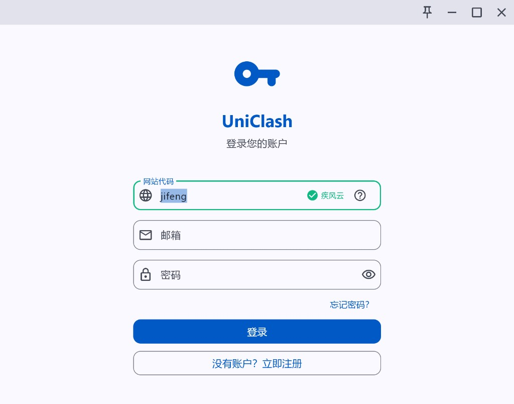
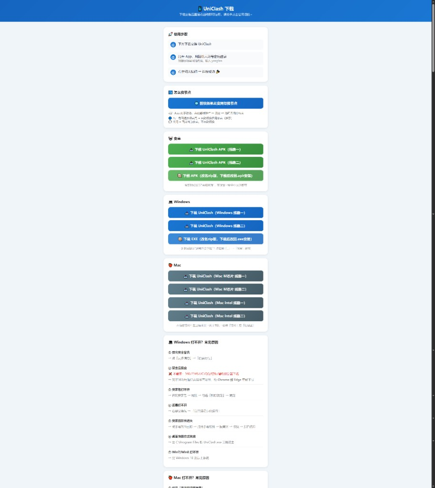
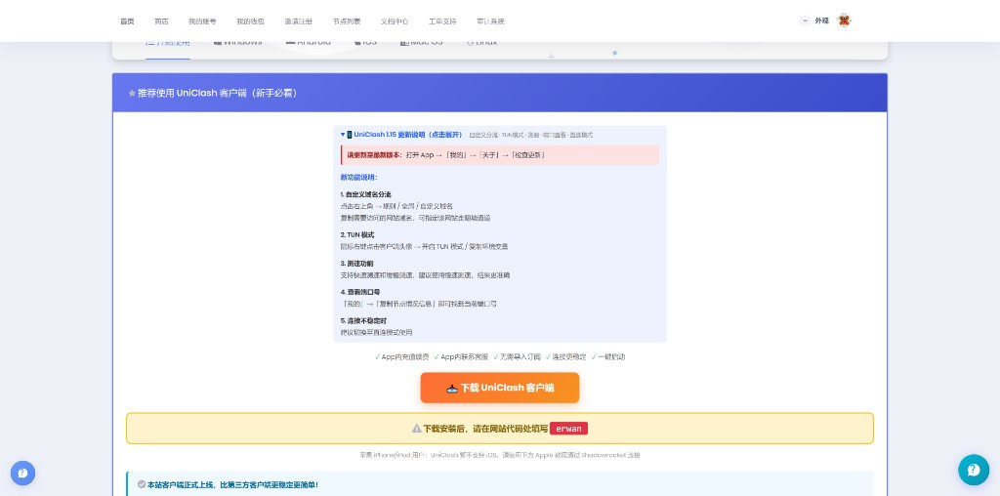
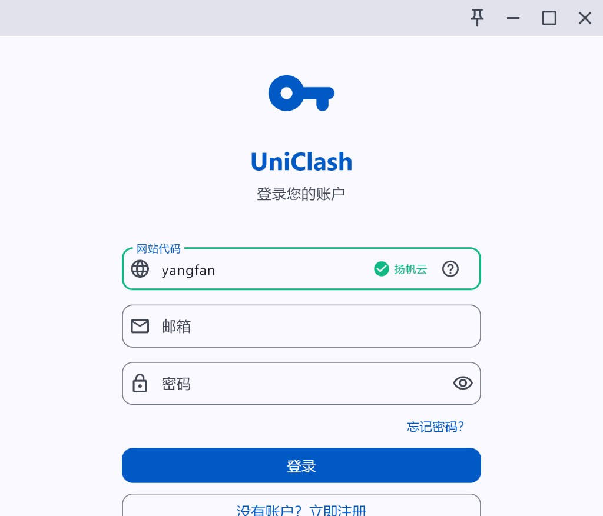
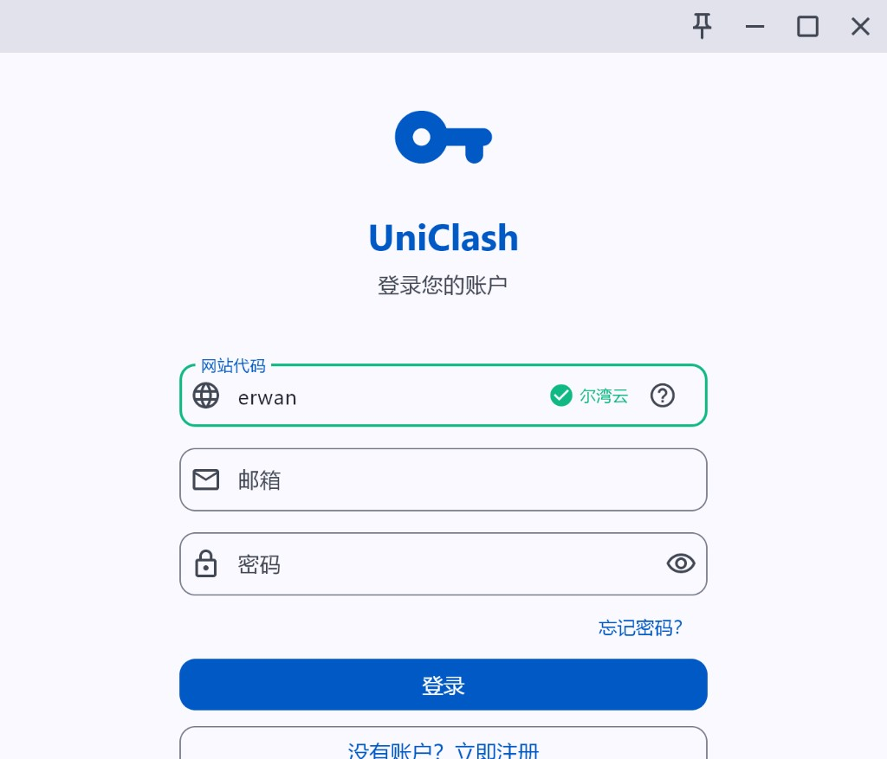
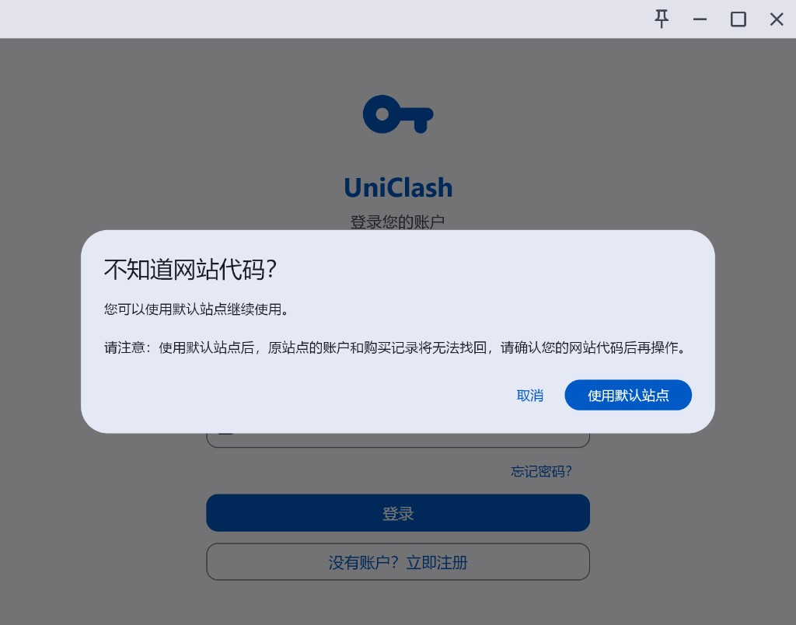
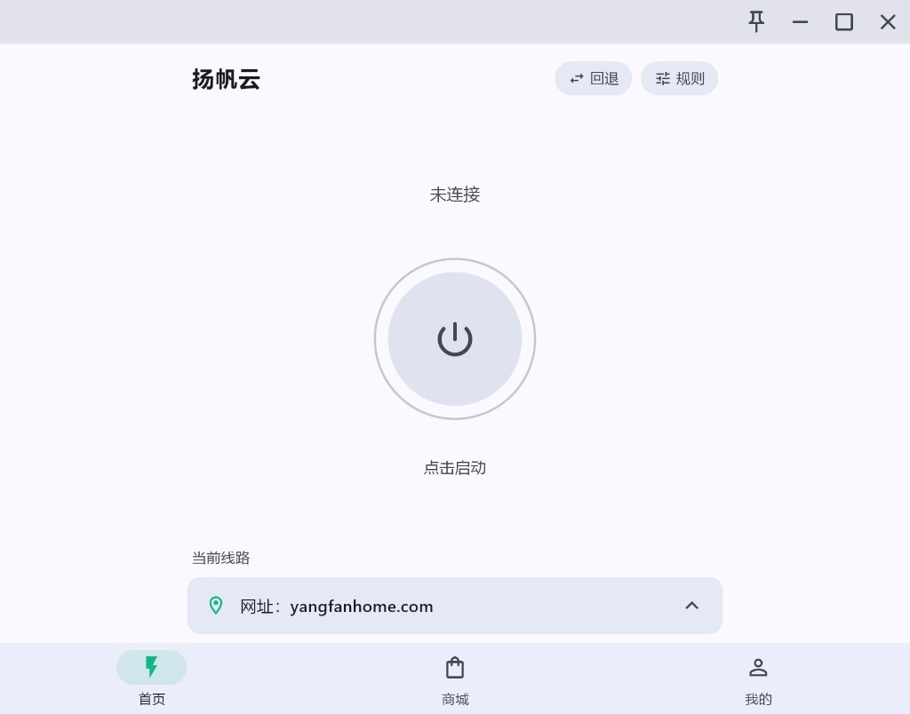
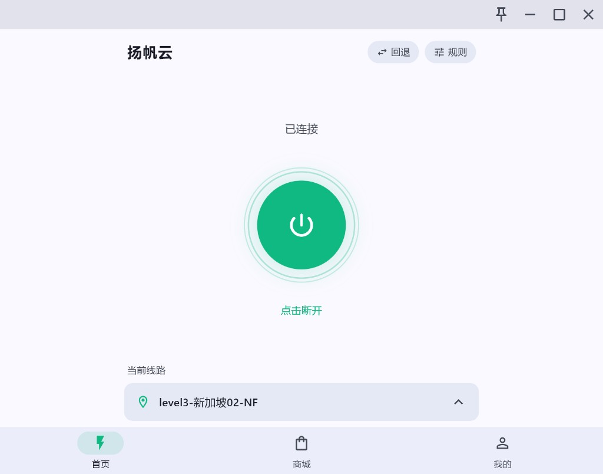
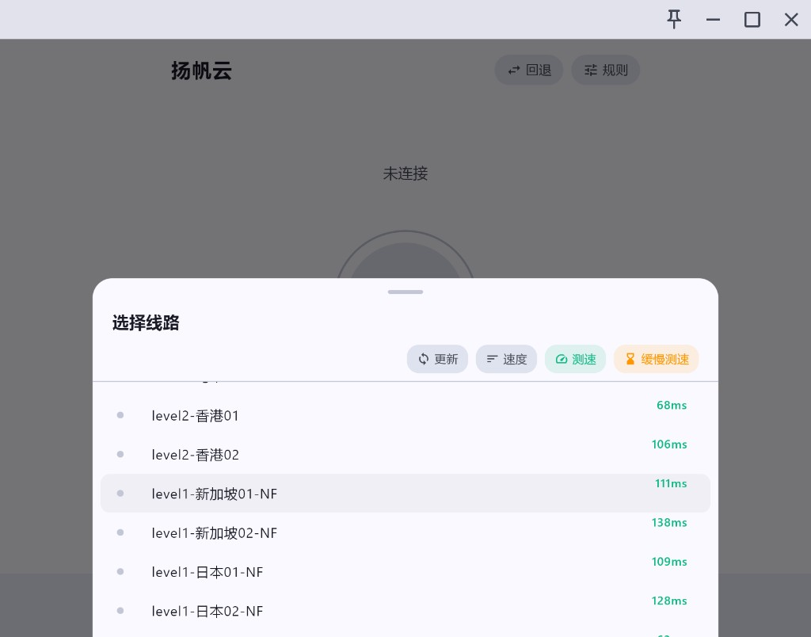

# UniClash 下载教程｜jifeng 疾风云 · yangfan 扬帆云 · erwan 尔湾云网站代码

> 📄 本文对应 HTML 页面：[UniClash 教程](../docs/pages/uniclash-guide.html)　·　🌐 在线阅读：<https://www.aixiaobai168.com/pages/uniclash-guide>

UniClash 是疾风云、扬帆云、尔湾云等机场推出的**定制版 Clash 客户端**。登录时除了邮箱密码，还要填一个"网站代码"——**疾风云填 `jifeng`，扬帆云填 `yangfan`，尔湾云填 `erwan`**。本文按"先注册账号 → 再下载客户端 → 网站代码登录"的顺序，把 Windows / Mac / 安卓三端的下载入口、登录截图、常见报错（打不开 / 全节点无信号 / 误点默认站点）整理在一起，对照排查即可。

---

## 📋 目录

- [一、UniClash 是什么](#一uniclash-是什么)
- [二、哪些机场支持 UniClash](#二哪些机场支持-uniclash)
- [三、UniClash 正确使用顺序（6 步）](#三uniclash-正确使用顺序6-步)
- [四、网站代码怎么填](#四网站代码怎么填)
- [五、Windows / Mac / Android 安装登录](#五windows--mac--android-安装登录)
- [六、登录后界面与节点切换](#六登录后界面与节点切换)
- [七、UniClash vs Clash Verge / OpenClash](#七uniclash-vs-clash-verge--openclash)
- [八、打不开 / 登录不上 / 全节点无信号排查](#八打不开--登录不上--全节点无信号排查)
- [九、常见问题 FAQ](#九常见问题-faq)

---

## 一、UniClash 是什么？

- **本质**：服务商提供的官方/定制 Clash 客户端，绑定服务商账号体系。
- **特点**：登录后即可一键连接，不需要手动导入订阅链接。
- **限制**：只能连接对应服务商的节点；并非所有机场都提供 UniClash。
- **适合**：已经在疾风云 / 扬帆云 / 尔湾云这类机场买了套餐、只想登录账号即用的新手。
- **不适合**：想自己导入多个订阅、改规则、玩 TUN 模式 → 请使用 [Clash Verge Rev](../windows/clash-verge-rev.md)、[MerlinClash](../asus-router/asus-merlinclash-setup.md)、OpenClash 等通用客户端。

> ⚠️ **不要把 UniClash 理解成"所有机场通用的官方 Clash"**，每家的下载页、网站代码、可用线路都不一样。本站已确认的服务商为疾风云、扬帆云与尔湾云。

---

## 二、哪些机场支持 UniClash？

截至 2026 年 5 月，本站**已确认**同时提供官方 UniClash 下载页 + 网站代码的机场：

| 服务商 | 网站代码 | 注册入口 | 客户端下载 | 支持平台 |
|--------|---------|---------|----------|---------|
| **疾风云** | `jifeng` | [注册疾风云](https://j134.net/?code=1p7r) | 注册登录后官网下载 | Android / Windows / Mac |
| **扬帆云** | `yangfan` | [注册扬帆云](https://www.aixiaobai168.com/go/yangfan/) | 注册登录后官网下载 | Android / Windows / Mac |
| **尔湾云** | `erwan` | [注册尔湾云](https://ewanwtt.net/auth/register?code=EGi8tb) | 注册登录后官网下载 | Android / Windows / Mac |

### 方案 A：疾风云 UniClash（推荐）

- 疾风云（JFCLOUD）节点按 V1–V4 分层；基础版 ¥19.99/月（100GB）、标准版 ¥29.99/月（200GB）、高级版 ¥39.99/月（350GB）。
- 年付 6.9 折码 `jf5169`，两年付 6.5 折码 `jff5165`，半年付 9 折码 `JF888`。
- UniClash 网站代码填 `jifeng`，输入后右侧显示绿色 ✓ 和"疾风云"字样，确认后继续输入邮箱密码登录。
- 客户端下载需先注册账号、购买套餐，再登录[疾风云官网](https://j134.net/?code=1p7r)获取（Windows / Mac / Android 均在官网下载页）。

### 方案 B：扬帆云 UniClash

- AI 解锁能力强：已验证可解锁 ChatGPT / Claude / Gemini 等主流 AI。
- 家宽专线 + 中转双线，年付 6.9 折优惠码 `yf6189`，两年付 6.5 折 `yf6185`，支持私人定制。
- UniClash 网站代码填 `yangfan`，输入后右侧显示绿色 ✓ 和"扬帆云"字样，确认后继续输入邮箱密码登录。
- 客户端下载需先[注册扬帆云](https://www.aixiaobai168.com/go/yangfan/)账号、购买套餐，再登录官网会员中心获取（Windows / Mac / Android）。

### 方案 C：尔湾云 UniClash

- 套餐梯度清晰，官方明确要求填写网站代码 `erwan`。
- 客户端下载需先[注册尔湾云](https://ewanwtt.net/auth/register?code=EGi8tb)账号、购买套餐，再登录官网会员中心获取（Windows / Mac / Android）。

> 💡 **为什么先注册再下载？** UniClash 登录界面要求"网站代码 + 邮箱 + 密码"，没有对应服务商账号即使装了客户端也无法登录；如果误点"使用默认站点"，原账号和购买记录就找不到了。

### 你在用的机场也支持 UniClash？

我们正在持续整理 UniClash 机场目录。如果你的机场也提供官方 UniClash 下载页和网站代码（且亲测可用），欢迎通过 GitHub Issues 反馈：

- 📝 [提交机场反馈](https://github.com/mowei-ie/router-vpn/issues/new?template=uniclash-airport-feedback.yml)（需 GitHub 账号）
- 👀 [查看已收到的反馈](https://github.com/mowei-ie/router-vpn/issues?q=is%3Aissue+label%3Auniclash)

> ⚠️ 提交时请勿包含订单号、邮箱、订阅链接等敏感信息。

---

## 三、UniClash 正确使用顺序（6 步）

按以下 6 步操作即可顺利登录使用，不要跳过注册和购买直接下载客户端：

1. **选服务商**：[疾风云](https://j134.net/?code=1p7r)、[扬帆云](https://www.aixiaobai168.com/go/yangfan/) 或 [尔湾云](https://ewanwtt.net/auth/register?code=EGi8tb)。
2. **注册账号**：点上面的服务商名称跳到注册页，填邮箱和密码。
3. **购买套餐**：付款后登录服务商官网确认账号有有效套餐和剩余流量。
4. **下载客户端**：三家都在注册登录官网后，从会员中心 / 官网下载页获取——疾风云从[疾风云官网](https://j134.net/?code=1p7r)登录后获取，扬帆云、尔湾云登录各自官网会员中心下载，不要用未注册的第三方裸下载页。
5. **填写网站代码**：疾风云填 `jifeng`，扬帆云填 `yangfan`，尔湾云填 `erwan`，看到绿色 ✓ 和服务商名再继续。
6. **输入邮箱密码登录**：用刚刚注册的服务商账号（不是本站账号），登录后点中间电源按钮即可连接。

> ⚠️ **不要随手点"使用默认站点"**：那不是疾风云、扬帆云或尔湾云的账号体系，点了就会找不到购买记录。

---

## 四、网站代码怎么填？

打开 UniClash 后第一步就是填网站代码。**正确填写后，输入框右侧会显示绿色对勾和服务商名称**（"疾风云""扬帆云"或"尔湾云"），这时再继续输入邮箱密码登录。

| 服务商 | 网站代码 | 输入正确后显示 |
|--------|---------|---------------|
| 疾风云 | `jifeng` | ✅ 疾风云 |
| 扬帆云 | `yangfan` | ✅ 扬帆云 |
| 尔湾云 | `erwan` | ✅ 尔湾云 |

|  |  |  |
|:---:|:---:|:---:|
| 疾风云：填 `jifeng`，绿色 ✓ 后显示"疾风云" | 扬帆云：填 `yangfan`，绿色 ✓ 后显示"扬帆云" | 尔湾云：填 `erwan`，绿色 ✓ 后显示"尔湾云" |

### 填写要点

- 只在 App 弹出"网站代码"输入框时填；不弹则直接输邮箱密码登录。
- 账号密码用**对应服务商官网**的，不是本站账号。
- **不要点"使用默认站点"**：那是另一个账号体系。

> 🚨 **误用默认站点怎么办？** 退出登录 → 重新打开 UniClash → 重新输入正确的网站代码（`jifeng`、`yangfan` 或 `erwan`），原账号和套餐就回来了。

---

## 五、Windows / Mac / Android 安装登录

三大平台都从对应服务商的下载页直接下载安装包，**不要从第三方网盘或二次打包站下载**。

### Android

1. 先在[扬帆云](https://www.aixiaobai168.com/go/yangfan/)、[尔湾云](https://ewanwtt.net/auth/register?code=EGi8tb) 或 [疾风云](https://j134.net/?code=1p7r) 官网注册登录，再到会员中心 / 官网下载页获取 Android 安装包。
2. 选 **下载 UniClash APK（线路一）**，速度慢就换线路二。
3. 提示"未知来源"时，去系统设置允许当前浏览器或文件管理器安装。
4. 下载页还提供 _改名 zip 版_，下载后把 `.zip` 改回 `.apk` 再安装。

### Windows（10 及以上）

1. 用 Chrome / Edge 下载；浏览器提示"通常不会下载"时点"保留"。
2. 双击 EXE 安装；若 Defender / 360 拦截，先关闭实时监控再装。
3. 下载页另有"EXE 改名 zip 版"，下载后改回 `.exe` 再运行。

### Mac

1. 先确认芯片：左上角苹果菜单 → **关于本机**。
   - "Apple M1/M2/M3" → 选 **Mac M 芯片版**
   - "Intel" → 选 **Mac Intel 版**
2. 下载 `.dmg` 后拖到"应用程序"。
3. 提示"无法验证开发者"：按住 **Control 单击** App 图标 → 打开。
4. 仍打不开：终端执行 `sudo xattr -cr /Applications/UniClash.app`。

> 📱 **iPhone 用户**：UniClash 目前只覆盖 Android / Windows / Mac，iOS 用户请使用 [Shadowrocket / Stash](../mobile/ios-shadowrocket.md)，需要外区 Apple ID 下载。

---

## 六、登录后界面与节点切换

登录成功后界面非常简单：中间一个大圆按钮控制连接，下方显示当前线路，底部三个 Tab 分别是"首页 / 商城 / 我的"。

|  |  |
|:---:|:---:|
| **未连接**：灰色电源按钮，提示"点击启动" | **已连接**：绿色按钮，下方显示当前节点 |

### 切换节点

1. 点底部"当前线路"那一栏的箭头，弹出"选择线路"面板。
2. 点右上角 **测速**，等延迟数字刷新出来。
3. 选延迟最低（一般 60–150 ms）的节点即可，点击后会自动切换。
4. 解锁 Netflix / ChatGPT 等流媒体优先选择带 `-NF` 标记的高级节点。

> 💡 **右上角"回退"按钮**：点亮时表示开启自动备用切换；如果只想固定某个节点，把它关掉。"规则"则用来切换全局/规则/直连模式。

---

## 七、UniClash vs Clash Verge / OpenClash

| 方案 | 优点 | 限制 | 推荐人群 |
|------|------|------|---------|
| **UniClash** | 登录账号即可用，无需手动导入订阅 | 绑定服务商生态，并非所有机场通用 | Windows / Mac / Android 新手 |
| [Clash Verge Rev](../windows/clash-verge-rev.md) | 多订阅 / 规则 / TUN 模式都灵活 | 需要理解系统代理、TUN、订阅链接 | 桌面端长期用户、多机场用户 |
| [MerlinClash](../asus-router/asus-merlinclash-setup.md) / OpenClash | 路由器全屋代理，一次配置全家用 | 排障成本更高 | 软路由、华硕梅林、旁路由用户 |
| [Shadowrocket / Stash](../mobile/ios-shadowrocket.md) | iPhone / iPad 端最常见 | 需要外区 Apple ID 下载 | iOS 用户 |

---

## 八、打不开 / 登录不上 / 全节点无信号排查

### Windows 打不开

- SmartScreen 安全警告 → 点"更多信息"→"仍要运行"。
- 双击没反应 → 换 Chrome / Edge 重新下载，临时关 360 / 电脑管家。
- 安装包打不开 → 右键属性 → 勾选"解除锁定"。
- Win7 / Win8 → UniClash 需要 Windows 10 及以上。

### Mac 打不开

- 无法验证开发者 → 按住 Control 单击 App → 打开。
- 无法检查恶意软件 → 系统设置 → 隐私与安全性 → 仍要打开。
- 磁盘映像打不开 → 先拖到"应用程序"，仍失败执行 `sudo xattr -cr /Applications/UniClash.app`。
- M 芯片不要下 Intel 版本。

### 登录后没有节点 / 全节点无信号

1. 检查是否登录的是**正确的服务商账号**。
2. 检查网站代码：疾风云 `jifeng`，扬帆云 `yangfan`，尔湾云 `erwan`。
3. 服务商官网确认套餐没过期、流量没用完。
4. 更新到最新 UniClash，再测速换低延迟节点。
5. 换手机热点测试，排除运营商或路由器 DNS 异常。

仍异常 → 去服务商官网首页查看公告，或在右下角联系在线客服；路由器全屋代理用户额外检查 MerlinClash / OpenClash 插件版本兼容性。

---

## 九、常见问题 FAQ

### Q1：UniClash 网站代码填什么？

按服务商填。疾风云填 `jifeng`，扬帆云填 `yangfan`，尔湾云填 `erwan`。如果 App 没提示网站代码，直接用服务商账号邮箱密码登录即可。

### Q2：UniClash 支持 iPhone / iPad 吗？

目前两家下载页都**只提供 Android / Windows / Mac**。iOS 用户请改用 [Shadowrocket / Stash](../mobile/ios-shadowrocket.md)，需要外区 Apple ID 下载。

### Q3：UniClash 和 Clash Verge Rev 哪个更适合新手？

买的是支持 UniClash 的机场（疾风云 / 扬帆云 / 尔湾云）就用 UniClash 更省心；用多个机场或要改规则、开 TUN 模式 → [Clash Verge Rev](../windows/clash-verge-rev.md) 更灵活。

### Q4：UniClash 登录成功但没有节点怎么办？

先确认：服务商账号正确 + 网站代码正确 + 套餐未过期 + 还有剩余流量。再更新客户端 + 测速选低延迟节点。

### Q5：可以从第三方网盘下载 UniClash 吗？

不建议。UniClash 涉及账号登录和网络代理，请优先走服务商官方下载页，避免下载到二次打包或被植入广告 / 后门的版本。

### Q6：之前点了"使用默认站点"，账号找不到了怎么办？

退出登录，重新打开 UniClash，把网站代码改回对应的 `jifeng`、`yangfan` 或 `erwan`，再用原邮箱密码登录即可。原服务商账号和套餐数据都还在。

### Q7：UniClash 安全吗？是不是官方客户端？

UniClash 是疾风云、扬帆云、尔湾云等机场的**官方/定制客户端**，由各服务商自行打包维护。安全使用的关键在于**下载渠道**：务必在注册登录官网后，从会员中心或官网指定的下载页获取安装包，切勿使用第三方网盘或非官方裸下载页，避免下载到被改装或植入后门的版本。

### Q8：UniClash 可以多设备同时登录吗？

可以，但**同时在线设备数受套餐限制**。以尔湾云为例：基础版 2 台、标准版 3 台、高级版 5 台；超出后新设备会被踢下线，需升级套餐。疾风云、扬帆云规则类似，以购买时套餐说明为准。

### Q9：UniClash 怎么更新到最新版？

节点超时或打不开时优先升级客户端。登录官网会员中心，找到 UniClash 下载页重新下载最新安装包覆盖安装（Windows / Android 直接覆盖，Mac 拖到"应用程序"替换）。覆盖安装后登录态保留，无需重填网站代码。

---

## 进阶使用与维护

### 更新升级

节点超时或打不开时，优先升级到最新 UniClash。登录对应官网会员中心下载最新版覆盖安装；Windows / Android 直接覆盖，Mac 拖到"应用程序"替换旧版，登录态保留。

### 卸载重装 / 重置

卸载后重装，重新填写网站代码（`jifeng` / `yangfan` / `erwan`）并用原邮箱密码登录即可，**账号和套餐数据在云端不丢**。

### 多设备与同时在线数

多台设备可登录同一账号，但同时在线数受套餐限制。尔湾云档位参考：

| 套餐 | 同时在线设备数 |
|------|--------------|
| 基础版 | 2 台 |
| 标准版 | 3 台 |
| 高级版 | 5 台 |

疾风云、扬帆云规则类似，超出需升级套餐。

### 节点能否导出订阅给其他客户端？

**不能**。UniClash 不对外暴露订阅链接，节点仅在 App 内可用。需要多客户端或自定义规则请改用 [Clash Verge Rev](../windows/clash-verge-rev.md)，用服务商官网的订阅链接手动导入。

### 续费与查流量

登录对应服务商官网会员中心可查看剩余流量与到期时间，UniClash App 内"我的"Tab 也显示余量。流量为套餐周期内一次性到账，不累计到下个周期；到期或流量耗尽后在官网续费即可。

---

## 相关文档

- [Clash 订阅申请指南](clash-subscription-guide.md)：机场对比、套餐价格、节点解锁能力
- [Windows Clash Verge Rev 教程](../windows/clash-verge-rev.md)：通用桌面客户端
- [手机翻墙教程](../mobile/android-clash-meta.md)：Android Clash Meta + iOS Shadowrocket
- [华硕路由器 MerlinClash](../asus-router/asus-merlinclash-setup.md)：路由器全屋代理

---

> 📌 本文只做客户端使用说明与下载入口整理，请以服务商官网公告为准。文档更新：2026 年 6 月（统一注册入口、补充进阶维护与 FAQ）。
