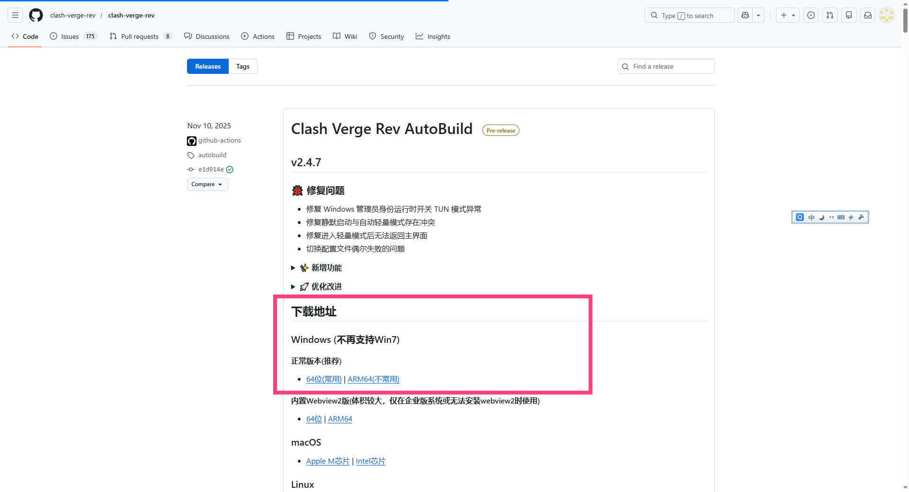
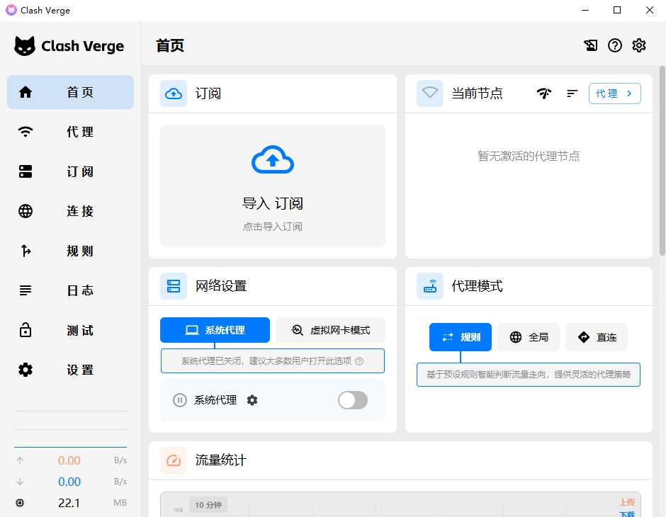
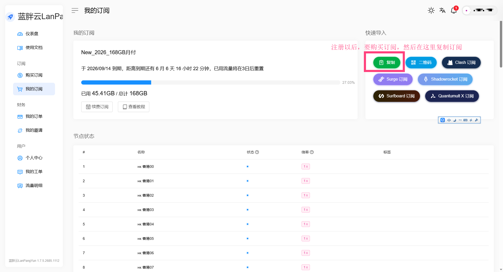
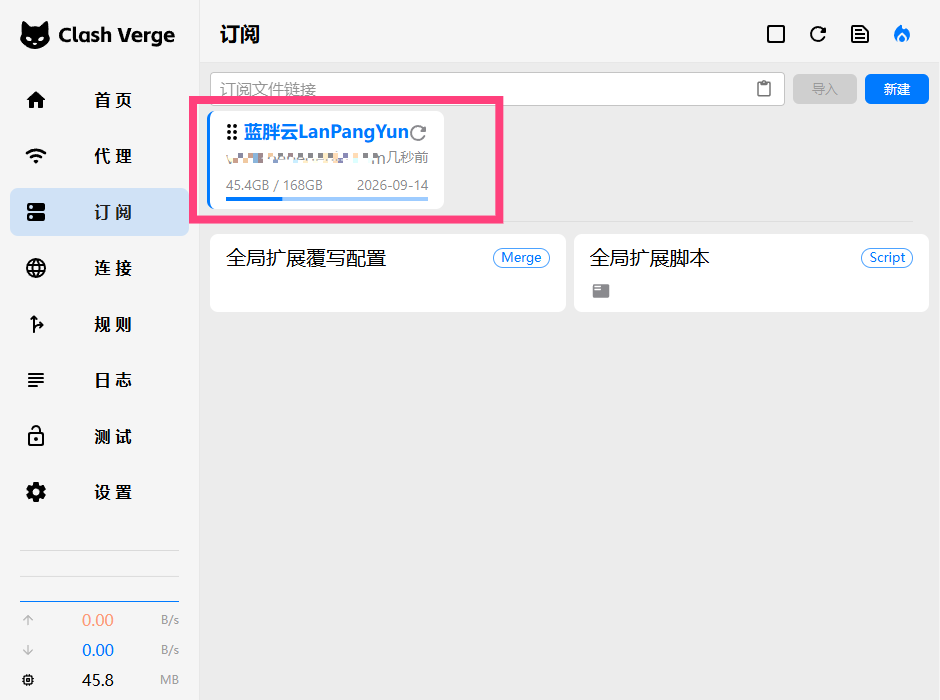
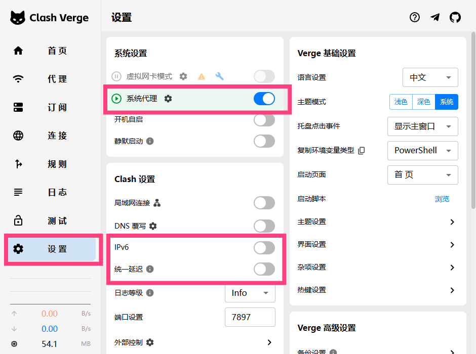
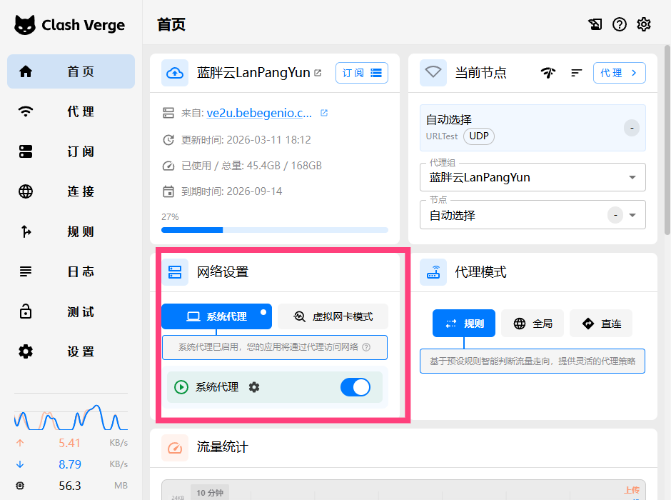
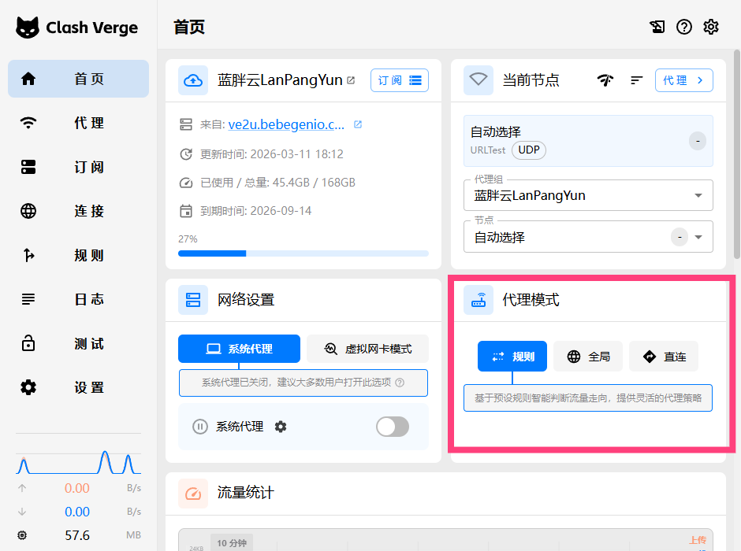
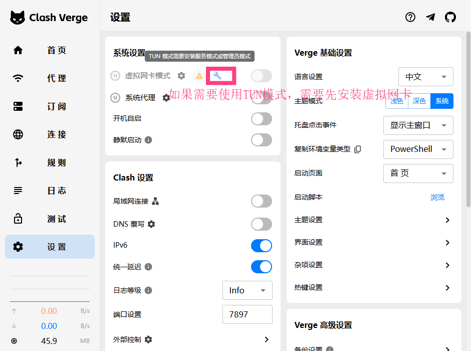
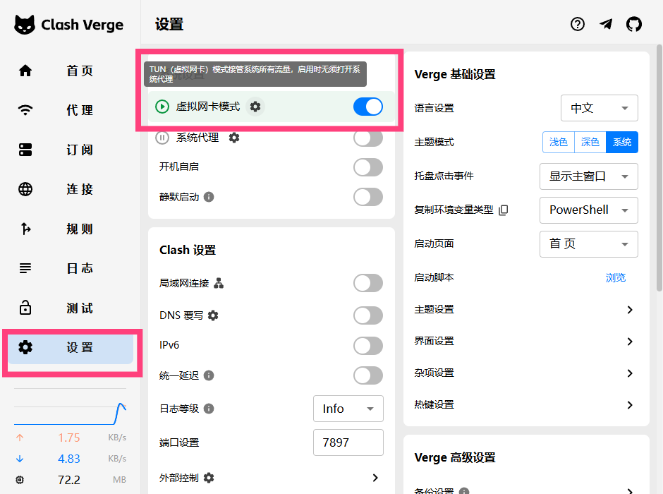
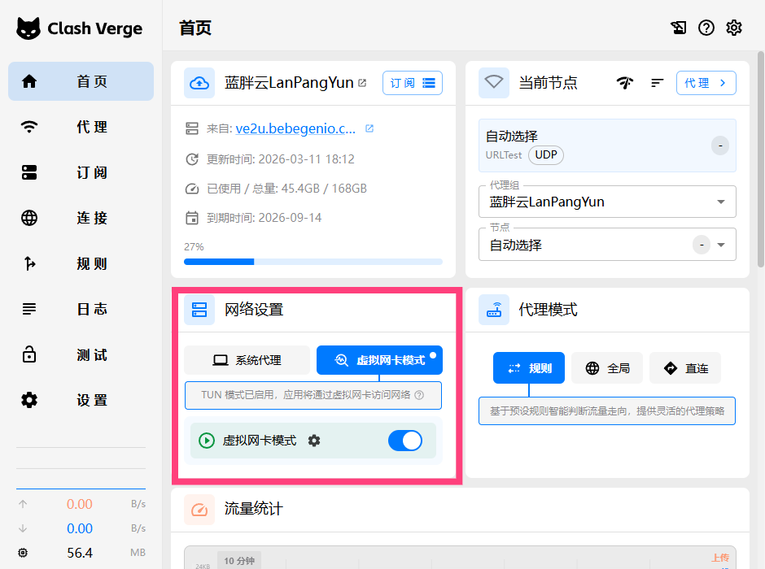

# Windows 翻墙教程 2026 — Clash Verge Rev 下载安装与科学上网配置

> 📄 本文对应 HTML 页面：[Windows 教程](../docs/pages/windows-guide.html)　·　🌐 在线阅读：<https://www.aixiaobai168.com/pages/windows-guide>

2026 最新 Windows 科学上网教程。本文指导您在 Windows 系统上使用 Clash Verge Rev 实现科学上网，适用于需要绕过网络审查、访问境外网站的场景。

---

## 📋 目录

- [一、软件介绍](#一软件介绍)
- [二、系统要求](#二系统要求)
- [三、下载安装](#三下载安装)
- [四、导入订阅](#四导入订阅)
- [五、启动代理](#五启动代理)
- [六、代理模式说明](#六代理模式说明)
- [七、TUN 模式详解](#七tun-模式详解)
- [八、分应用代理](#八分应用代理)
- [九、规则与分流](#九规则与分流)
- [十、开机自启](#十开机自启)
- [十一、常见问题](#十一常见问题)
- [十二、进阶配置](#十二进阶配置)

---

## 一、软件介绍

### 什么是 Clash Verge Rev？

**Clash Verge Rev** 是一款基于 Clash 内核的跨平台代理客户端，专为 Windows、macOS 和 Linux 设计。它提供图形化界面，支持订阅管理、规则分流、TUN 模式等高级功能，是当前 Windows 上最活跃维护的 Clash 客户端之一。

### 为什么选择 Clash Verge Rev？

- **开源免费**：基于 MIT 协议，代码透明可审计
- **功能完善**：支持订阅、规则、TUN、脚本模式等
- **持续维护**：社区活跃，定期更新修复问题
- **跨平台**：同一套配置可在多系统使用

### 关于 Clash for Windows (CFW)

**Clash for Windows** 曾是 Windows 上最流行的 Clash 图形客户端，但项目已于 2023 年 11 月停止维护。Clash Verge Rev 是 CFW 的继任者之一，采用 Rust 重写，性能更好、资源占用更低，建议新用户直接使用 Clash Verge Rev。需要完整替代品对比和迁移思路，可先看 [CFW 停更后怎么办：替代品对比与迁移指南](clash-for-windows-alternative.md)。

---

## 二、系统要求

| 项目 | 要求 |
|------|------|
| **操作系统** | Windows 10 64 位 或 Windows 11 64 位 |
| **架构** | x64 (amd64)，不支持 32 位系统 |
| **磁盘空间** | 约 100MB |
| **.NET 运行时** | 部分版本可能需要 .NET 6.0 或更高（若安装包为依赖版） |

### 检查系统版本

```powershell
# 在 PowerShell 中执行
[System.Environment]::OSVersion.Version
# 或
winver
```

若需安装 .NET 运行时，可从 [Microsoft .NET 下载页](https://dotnet.microsoft.com/download) 获取。

---

## 三、下载安装

### 1. 访问 GitHub 发布页

打开 Clash Verge Rev 的官方发布页面：

**https://github.com/clash-verge-rev/clash-verge-rev/releases**



### 2. 选择安装包

在 **Assets** 区域找到适合 Windows x64 的安装包：

- **clash-verge-rev_x.x.x_x64-setup.exe** — 推荐，带安装向导
- **clash-verge-rev_x.x.x_x64-portable.zip** — 便携版，解压即用

选择 `*_x64-setup.exe` 进行标准安装。


### 3. 安装步骤

1. 双击下载的 `.exe` 安装包
2. 若出现 **Windows 安全提示**，点击「更多信息」→「仍要运行」
3. 选择安装路径（默认即可）并点击「安装」
4. 安装完成后，勾选「启动 Clash Verge Rev」并点击「完成」


### 4. 验证安装

启动后应看到 Clash Verge Rev 主界面，包含 **Profiles**、**Proxies**、**Logs** 等标签页。



---

## 四、导入订阅

### 1. 获取订阅链接

从您的机场/代理服务商获取 **订阅链接**（通常为 `https://xxx.com/api/v1/client/subscribe?token=xxx` 格式）。请妥善保管，不要泄露。
#### 购买 & 获取 Clash 订阅推荐

如果您尚未拥有可用的 Clash 订阅节点，可参考本站整理的购买指引页面获取热门机场节点推荐与详细购买流程：

- 👉 [Clash 订阅购买全指南（节点推荐、机场注册与入门教程）](https://www.aixiaobai168.com/clash-subscription-guide.html)

该页面持续收录优质机场稳定节点，帮助新手快速入门体验 Clash 科学上网。强烈建议前往查看、对比适合自己的节点套餐后购买，订阅链接在购买/注册后会自动生成。

> 注：请合法、合规地使用网络服务，仅作学习与研究用途，实际使用请自备节点订阅，不随意泄露或传播订阅内容。

- **蓝胖云机场注册地址**  
  注册 & 购买节点推荐（可体验与自用，按需注册）：

  [https://jpp.lanpangyun.me/#/register?code=30Y2Sexl](https://jpp.lanpangyun.me/#/register?code=30Y2Sexl)




### 2. 导入订阅

1. 打开 Clash Verge Rev
2. 点击左侧 **Profiles**（配置）标签
3. 在顶部输入框粘贴订阅链接
4. 点击 **Import**（导入）按钮


### 3. 选择配置

导入成功后，配置列表会出现新条目。点击该配置名称，使其变为当前使用的配置（高亮显示）。



### 4. 更新订阅

- 点击配置右侧的 **刷新** 图标可手动更新
- 建议在 **Settings → Profiles** 中开启 **Auto Update**，设置自动更新间隔（如 24 小时）

---

## 五、启动代理

### 系统代理模式（System Proxy）

1. 在主界面找到 **System Proxy** 开关
2. 打开开关，系统代理将指向 Clash（默认 `127.0.0.1:7897`）
3. 支持系统代理的软件（如浏览器、部分应用）会自动走代理



#### 首页的开关位置


### TUN 模式 vs 系统代理模式

| 特性 | 系统代理 | TUN 模式 |
|------|----------|----------|
| **覆盖范围** | 仅支持系统代理的应用 | 几乎所有应用（全局） |
| **需要管理员** | 否 | 是（安装 TUN 驱动） |
| **UWP 应用** | 需额外配置 Loopback | 直接支持 |
| **游戏/客户端** | 可能不走代理 | 通常可走代理 |
| **DNS 处理** | 依赖应用自身 | 可统一接管 |

日常浏览推荐先用 **系统代理**，若部分软件不走代理，再考虑开启 **TUN 模式**。

---

## 六、代理模式说明

在 **Proxies** 标签页可切换全局代理模式：

| 模式 | 说明 |
|------|------|
| **Rule（规则）** | 按规则分流：国内直连，国外走代理。**推荐日常使用** |
| **Global（全局）** | 所有流量走代理 |
| **Direct（直连）** | 所有流量直连，不走代理 |
| **Script（脚本）** | 使用 JavaScript 脚本自定义分流逻辑 |



---

## 七、TUN 模式详解

### 什么是 TUN 模式？

TUN 模式通过虚拟网卡接管系统网络流量，实现**真正的全局代理**，无需应用支持系统代理。

### 启用 TUN 模式

1. 点击主界面的 **TUN** 开关
2. 首次使用会提示安装 **wintun** 驱动，需**管理员权限**
3. 按提示完成驱动安装后，TUN 模式即可生效


首次启用 TUN 模式时，会提示安装虚拟网卡，需要**管理员权限**，安装前如遇杀毒软件报错可暂时退出杀毒软件。


成功安装后，TUN 功能相关开关会正常亮起。  


首页也有 TUN 模式快捷开关。如遇无法安装或功能不可用，可尝试**以管理员身份重启 Clash Verge Rev**，或重启电脑后重试。



### TUN 模式优势

- **全局生效**：游戏、UWP 应用、命令行工具等均可走代理
- **DNS 可控**：可统一处理 DNS，减少泄露风险
- **透明代理**：应用无感知，无需单独配置

### 注意事项

- 安装驱动时请确保网络畅通，避免下载失败
- 若驱动安装失败，可尝试以管理员身份运行 Clash Verge Rev
- 部分企业/学校网络可能限制 TUN 驱动安装

---

## 八、分应用代理

### UWP 应用（Microsoft Store）不走代理？

UWP 应用默认有网络隔离，即使开启系统代理，也可能无法使用。需要配置 **Loopback 豁免**。

### 使用 CheckNetIsolation 工具

以**管理员身份**打开 PowerShell 或 CMD，执行：

```powershell
# 查看已安装的 UWP 应用
Get-AppxPackage | Select Name, PackageFamilyName

# 为指定应用添加 Loopback 豁免（示例：Microsoft Edge）
CheckNetIsolation.exe LoopbackExempt -a -n="Microsoft.MicrosoftEdge_8wekyb3d8bbwe"

# 为所有 UWP 应用添加豁免（不推荐，仅作参考）
Get-AppxPackage | ForEach-Object { CheckNetIsolation.exe LoopbackExempt -a -n=$_.PackageFamilyName }
```

### 查找应用的 PackageFamilyName

```powershell
# 示例：查找 Telegram
Get-AppxPackage *Telegram* | Select Name, PackageFamilyName
```

将输出的 `PackageFamilyName` 填入上述命令的 `-n=` 参数。

### 使用图形化工具（可选）

可使用 [EnableLoopback](https://github.com/tiagonmas/EnableLoopback) 等工具，通过图形界面勾选需要豁免的应用。

---

## 九、规则与分流

### 规则如何工作？

Clash 按**从上到下**的顺序匹配规则，命中即执行对应动作（走代理、直连或拒绝）。

### 默认规则结构

订阅配置通常包含类似结构：

```yaml
rules:
  - DOMAIN-SUFFIX,google.com,PROXY
  - DOMAIN-SUFFIX,youtube.com,PROXY
  - GEOIP,CN,DIRECT
  - MATCH,PROXY
```

- `DOMAIN-SUFFIX`：域名后缀匹配
- `GEOIP,CN`：中国 IP 直连
- `MATCH`：默认规则，未匹配的走 PROXY

### 自定义规则

在 **Profiles** 中编辑配置，或使用 **Settings → Config** 中的 **Prepend Rules** / **Append Rules** 追加规则：

```yaml
# 示例：屏蔽某域名
- DOMAIN,ads.example.com,REJECT

# 示例：某域名强制直连
- DOMAIN-SUFFIX,internal.company.com,DIRECT
```

### 引用规则集（Rule Providers）

高级配置可引用远程规则集：

```yaml
rule-providers:
  reject:
    type: http
    url: "https://cdn.jsdelivr.net/gh/Loyalsoldier/clash-rules@release/reject.txt"
    path: ./ruleset/reject.yaml
    interval: 86400

rules:
  - RULE-SET,reject,REJECT
  # ... 其他规则
```

---

## 十、开机自启

### 方法一：软件内设置

1. 打开 **Settings**（设置）
2. 找到 **General** 或 **Startup** 相关选项
3. 开启 **Launch on system startup**（开机启动）

> 截图待补充：开机自启设置界面

### 方法二：Windows 任务计划程序

若软件内无此选项，可使用任务计划程序：

1. 按 `Win + R`，输入 `taskschd.msc`，回车
2. 右侧点击「创建基本任务」
3. 名称填「Clash Verge Rev」，触发器选「当计算机启动时」
4. 操作选「启动程序」，程序填 Clash Verge Rev 的安装路径，例如：
   ```
   C:\Users\你的用户名\AppData\Local\Programs\clash-verge-rev\Clash Verge Rev.exe
   ```
5. 完成创建，勾选「打开属性」→「常规」→勾选「使用最高权限运行」（若需 TUN）

---

## 十一、常见问题

### 1. 端口冲突

**现象**：启动失败，提示端口被占用。

**解决**：在 **Settings → Clash** 中修改端口（如 `7897` 改为 `7898`），或关闭占用端口的其他代理软件。

```powershell
# 查看端口占用（示例：7897）
netstat -ano | findstr 7897
```

### 2. TUN 驱动安装失败

**现象**：点击 TUN 后提示驱动安装失败。

**解决**：
- 以**管理员身份**运行 Clash Verge Rev
- 暂时关闭杀毒软件/安全软件后重试
- 手动下载 [wintun](https://www.wintun.net/) 并安装

### 3. 订阅更新失败

**现象**：点击更新后无反应或报错。

**解决**：
- 检查订阅链接是否有效（浏览器直接访问测试）
- 检查网络是否正常，尝试切换节点后再更新
- 部分机场需在网页端重新生成订阅链接

### 4. DNS 泄露

**现象**：代理开启后，DNS 查询仍走本地，可能泄露访问记录。

**解决**：
- 开启 **TUN 模式**，由 Clash 统一处理 DNS
- 在配置中启用 `dns.enable` 和合适的 `fake-ip` 或 `redir-host` 模式
- 使用 `tls://` 或 `https://` 的 DoH/DoT DNS

### 5. 部分网站无法访问

**现象**：开启代理后，国内网站变慢或无法打开。

**解决**：
- 确认代理模式为 **Rule（规则）**，而非 Global
- 检查规则是否将国内域名错误地指向代理
- 更新订阅或规则集

---

## 十二、进阶配置

### 自定义配置覆写

在 **Settings → Config** 中可添加 **Prepend** 或 **Append** 配置，对当前配置进行覆写，无需直接编辑订阅生成的 YAML。

### External Controller API

Clash 提供 REST API，默认地址为 `127.0.0.1:9090`。可用于：
- 第三方面板控制
- 脚本自动化（切换节点、模式等）

```powershell
# 示例：获取当前配置（需安装 curl 或使用 Invoke-WebRequest）
Invoke-WebRequest -Uri "http://127.0.0.1:9090/configs" -UseBasicParsing
```

### Clash Dashboard

在 **Settings** 中可配置 **Dashboard** 地址，使用 Yacd、Razord 等 Web 面板进行可视化管理：

- Yacd: `https://yacd.haishan.me`
- 或使用本地 HTML 文件路径

---

## 相关链接

- [Clash Verge Rev GitHub](https://github.com/clash-verge-rev/clash-verge-rev)
- [Clash 内核文档](https://github.com/Dreamacro/clash)
- [订阅与机场入门](../docs/clash-subscription-guide.html)

---

*文档最后更新：2025 年 3 月*
